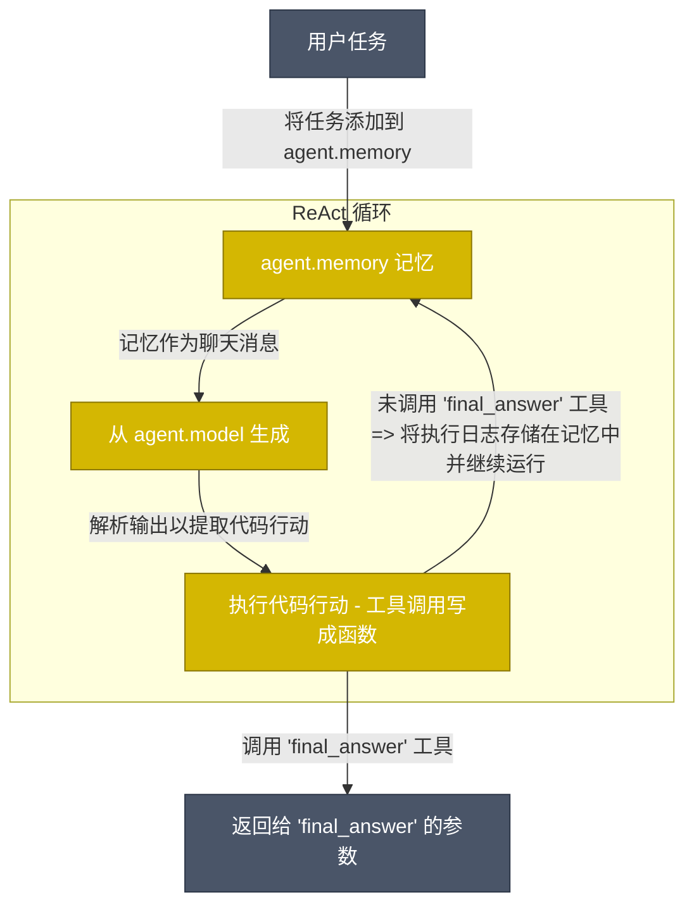

<!---
Copyright 2024 The HuggingFace Team. All rights reserved.

Licensed under the Apache License, Version 2.0 (the "License");
you may not use this file except in compliance with the License.
You may obtain a copy of the License at

    http://www.apache.org/licenses/LICENSE-2.0

Unless required by applicable law or agreed to in writing, software
distributed under the License is distributed on an "AS IS" BASIS,
WITHOUT WARRANTIES OR CONDITIONS OF ANY KIND, either express or implied.
See the License for the specific language governing permissions and
limitations under the License.
-->
<p align="center">
    <a href="https://github.com/huggingface/smolagents/blob/main/LICENSE"></a>
    <a href="https://huggingface.co/docs/smolagents"></a>
    <a href="https://github.com/huggingface/smolagents/releases"></a>
    <a href="https://github.com/huggingface/smolagents/blob/main/CODE_OF_CONDUCT.md"></a>
</p>

<h3 align="center">
  <div style="display:flex;flex-direction:row;">
    
    <p>用代码思考的 Agent！</p>
  </div>
</h3>

[English](README.md) | 简体中文

`smolagents` 是一个让你用几行代码就能运行强大 Agent 的库。它提供：

✨ **简洁性**：Agent 的核心逻辑只有约 1,000 行代码（见 [agents.py](https://github.com/huggingface/smolagents/blob/main/src/smolagents/agents.py)）。我们将抽象保持在最小化！

🧑‍💻 **一流的 Code Agent 支持**。我们的 [`CodeAgent`](https://huggingface.co/docs/smolagents/reference/agents#smolagents.CodeAgent) 用代码编写行动（而不是"用 Agent 来写代码"）。为了安全，我们支持在沙箱环境中执行，包括 [Blaxel](https://blaxel.ai)、[E2B](https://e2b.dev/)、[Modal](https://modal.com/)、Docker 或 Pyodide+Deno WebAssembly 沙箱。

🤗 **Hub 集成**：你可以[从 Hub 分享/拉取工具或 Agent](https://huggingface.co/docs/smolagents/reference/tools#smolagents.Tool.from_hub)，即时分享最高效的 Agent！

🌐 **模型无关**：smolagents 支持任何 LLM。可以是本地的 `transformers` 或 `ollama` 模型，[Hub 上的众多提供商](https://huggingface.co/blog/inference-providers)之一，或通过我们的 [LiteLLM](https://www.litellm.ai/) 集成使用 OpenAI、Anthropic 等的模型。

👁️ **模态无关**：Agent 支持文本、视觉、视频，甚至音频输入！参见[这个教程](https://huggingface.co/docs/smolagents/examples/web_browser)了解视觉功能。

🛠️ **工具无关**：你可以使用来自任何 [MCP 服务器](https://huggingface.co/docs/smolagents/reference/tools#smolagents.ToolCollection.from_mcp)、[LangChain](https://huggingface.co/docs/smolagents/reference/tools#smolagents.Tool.from_langchain) 的工具，甚至可以将 [Hub Space](https://huggingface.co/docs/smolagents/reference/tools#smolagents.Tool.from_space) 用作工具。

完整文档请访问[这里](https://huggingface.co/docs/smolagents/index)。

> [!NOTE]
> 查看我们的[发布博客文章](https://huggingface.co/blog/smolagents)了解更多关于 `smolagents` 的信息！

## 快速演示

首先安装带有默认工具集的包：
```bash
pip install "smolagents[toolkit]"
```

然后定义你的 Agent，给它所需的工具并运行！
```py
from smolagents import CodeAgent, WebSearchTool, InferenceClientModel

model = InferenceClientModel()
agent = CodeAgent(tools=[WebSearchTool()], model=model, stream_outputs=True)

agent.run("一只全速奔跑的豹子穿过艺术桥需要多少秒？")
```

https://github.com/user-attachments/assets/84b149b4-246c-40c9-a48d-ba013b08e600

你甚至可以将 Agent 分享到 Hub，作为 Space 仓库：
```py
agent.push_to_hub("m-ric/my_agent")

# 使用 agent.from_hub("m-ric/my_agent") 从 Hub 加载 Agent
```

我们的库是 LLM 无关的：你可以将上面的示例切换到任何推理提供商。

<details>
<summary> <b>InferenceClientModel，HF 支持的所有<a href="https://huggingface.co/docs/inference-providers/index">推理提供商</a>的网关</b></summary>

```py
from smolagents import InferenceClientModel

model = InferenceClientModel(
    model_id="deepseek-ai/DeepSeek-R1",
    provider="together",
)
```
</details>
<details>
<summary> <b>LiteLLM 访问 100+ LLM</b></summary>

```py
from smolagents import LiteLLMModel

model = LiteLLMModel(
    model_id="anthropic/claude-4-sonnet-latest",
    temperature=0.2,
    api_key=os.environ["ANTHROPIC_API_KEY"]
)
```
</details>
<details>
<summary> <b>OpenAI 兼容服务器：Together AI</b></summary>

```py
import os
from smolagents import OpenAIModel

model = OpenAIModel(
    model_id="deepseek-ai/DeepSeek-R1",
    api_base="https://api.together.xyz/v1/",  # 留空以查询 OpenAI 服务器
    api_key=os.environ["TOGETHER_API_KEY"],  # 切换到目标服务器的 API key
)
```
</details>
<details>
<summary> <b>OpenAI 兼容服务器：OpenRouter</b></summary>

```py
import os
from smolagents import OpenAIModel

model = OpenAIModel(
    model_id="openai/gpt-4o",
    api_base="https://openrouter.ai/api/v1",  # 留空以查询 OpenAI 服务器
    api_key=os.environ["OPENROUTER_API_KEY"],  # 切换到目标服务器的 API key
)
```

</details>
<details>
<summary> <b>本地 `transformers` 模型</b></summary>

```py
from smolagents import TransformersModel

model = TransformersModel(
    model_id="Qwen/Qwen3-Next-80B-A3B-Thinking",
    max_new_tokens=4096,
    device_map="auto"
)
```
</details>
<details>
<summary> <b>Azure 模型</b></summary>

```py
import os
from smolagents import AzureOpenAIModel

model = AzureOpenAIModel(
    model_id = os.environ.get("AZURE_OPENAI_MODEL"),
    azure_endpoint=os.environ.get("AZURE_OPENAI_ENDPOINT"),
    api_key=os.environ.get("AZURE_OPENAI_API_KEY"),
    api_version=os.environ.get("OPENAI_API_VERSION")    
)
```
</details>
<details>
<summary> <b>Amazon Bedrock 模型</b></summary>

```py
import os
from smolagents import AmazonBedrockModel

model = AmazonBedrockModel(
    model_id = os.environ.get("AMAZON_BEDROCK_MODEL_ID") 
)
```
</details>

## 命令行界面（CLI）

你可以使用两个命令从 CLI 运行 Agent：`smolagent` 和 `webagent`。

`smolagent` 是一个通用命令，用于运行可配备各种工具的多步骤 `CodeAgent`。

```bash
# 使用直接提示和选项运行
smolagent "计划 3 月 28 日至 4 月 7 日期间去东京、京都和大阪的旅行。"  --model-type "InferenceClientModel" --model-id "Qwen/Qwen3-Next-80B-A3B-Thinking" --imports pandas numpy --tools web_search

# 以交互模式运行（未提供提示时启动设置向导）
smolagent
```

交互模式会引导你完成：
- Agent 类型选择（CodeAgent vs ToolCallingAgent）
- 从可用工具箱中选择工具
- 模型配置（类型、ID、API 设置）
- 高级选项，如额外导入
- 任务提示输入

而 `webagent` 是一个使用 [helium](https://github.com/mherrmann/helium) 的特定网页浏览 Agent（更多信息见[这里](https://github.com/huggingface/smolagents/blob/main/src/smolagents/vision_web_browser.py)）。

例如：
```bash
webagent "访问 xyz.com/men，进入促销区，点击你看到的第一件服装。获取产品详情和价格，返回它们。注意我从法国购物" --model-type "LiteLLMModel" --model-id "gpt-5"
```

## Code Agent 如何工作？

我们的 [`CodeAgent`](https://huggingface.co/docs/smolagents/reference/agents#smolagents.CodeAgent) 的工作方式与经典的 ReAct Agent 基本相同 - 不同之处在于 LLM 引擎将其行动编写为 Python 代码片段。



行动现在是 Python 代码片段。因此，工具调用将作为 Python 函数调用执行。例如，以下是 Agent 如何在一个行动中对多个网站执行网页搜索：

```py
requests_to_search = ["墨西哥湾 美国", "格陵兰 丹麦", "关税"]
for request in requests_to_search:
    print(f"这是 {request} 的搜索结果：", web_search(request))
```

将行动编写为代码片段被证明比当前行业实践（让 LLM 输出它想调用的工具字典）效果更好：[减少 30% 的步骤](https://huggingface.co/papers/2402.01030)（因此减少 30% 的 LLM 调用）并且[在困难基准测试上达到更高性能](https://huggingface.co/papers/2411.01747)。前往[我们的 Agent 高级介绍](https://huggingface.co/docs/smolagents/conceptual_guides/intro_agents)了解更多。

特别是，由于代码执行可能是一个安全问题（任意代码执行！），我们在运行时提供选项：
  - 一个安全的 Python 解释器，在你的环境中更安全地运行代码（比原始代码执行更安全，但仍有风险）
  - 使用 [Blaxel](https://blaxel.ai)、[E2B](https://e2b.dev/) 或 Docker 的沙箱环境（消除对你自己系统的风险）

除了 [`CodeAgent`](https://huggingface.co/docs/smolagents/reference/agents#smolagents.CodeAgent)，我们还提供标准的 [`ToolCallingAgent`](https://huggingface.co/docs/smolagents/reference/agents#smolagents.ToolCallingAgent)，它将行动编写为 JSON/文本块。你可以选择最适合你用例的风格。

## 这个库有多小（smol）？

我们努力将抽象保持在严格的最小值：`agents.py` 中的主要代码少于 1,000 行。
尽管如此，我们实现了几种类型的 Agent：`CodeAgent` 将其行动编写为 Python 代码片段，而更经典的 `ToolCallingAgent` 利用内置的工具调用方法。我们还有多 Agent 层次结构、从工具集合导入、远程代码执行、视觉模型等功能...

顺便说一句，为什么要使用框架？嗯，因为这些东西的很大一部分是非平凡的。例如，Code Agent 必须在其系统提示、解析器、执行过程中保持代码的一致格式。所以我们的框架为你处理这种复杂性。但当然，我们仍然鼓励你深入源代码，只使用你需要的部分，排除其他所有内容！

## 开源模型在 Agent 工作流中有多强？

我们用一些领先的模型创建了 [`CodeAgent`](https://huggingface.co/docs/smolagents/reference/agents#smolagents.CodeAgent) 实例，并在[这个基准测试](https://huggingface.co/datasets/m-ric/agents_medium_benchmark_2)上进行了比较，该基准测试从几个不同的基准测试中收集问题，提供了各种挑战的混合。

[在这里找到基准测试代码](https://github.com/huggingface/smolagents/blob/main/examples/smolagents_benchmark/run.py)，了解所使用的 Agent 设置的更多细节，并查看使用 LLM Code Agent 与原始版本的比较（剧透：Code Agent 效果更好）。

<p align="center">
    
</p>

这个比较表明，开源模型现在可以与最好的闭源模型竞争！

## 安全性

在使用执行代码的 Agent 时，安全性是一个关键考虑因素。我们的库提供：
- 使用 [Blaxel](https://blaxel.ai)、[E2B](https://e2b.dev/)、[Modal](https://modal.com/)、Docker 或 Pyodide+Deno WebAssembly 沙箱的沙箱执行选项
- 安全运行 Agent 代码的最佳实践

有关安全策略、漏洞报告以及有关安全 Agent 执行的更多信息，请参阅我们的[安全策略](SECURITY.md)。

## 贡献

欢迎所有人贡献，请从我们的[贡献指南](https://github.com/huggingface/smolagents/blob/main/CONTRIBUTING.md)开始。

## 引用 smolagents

如果你在出版物中使用 `smolagents`，请使用以下 BibTeX 条目引用它。

```bibtex
@Misc{smolagents,
  title =        {`smolagents`: a smol library to build great agentic systems.},
  author =       {Aymeric Roucher and Albert Villanova del Moral and Thomas Wolf and Leandro von Werra and Erik Kaunismäki},
  howpublished = {\url{https://github.com/huggingface/smolagents}},
  year =         {2025}
}
```
