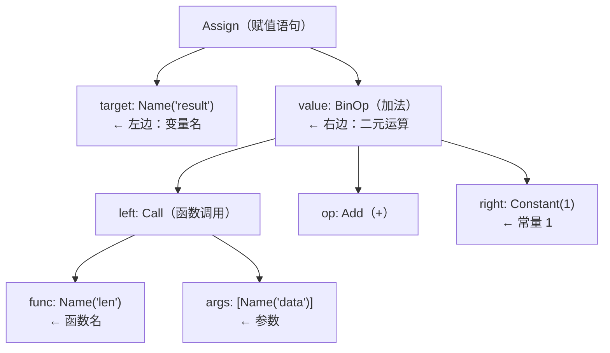
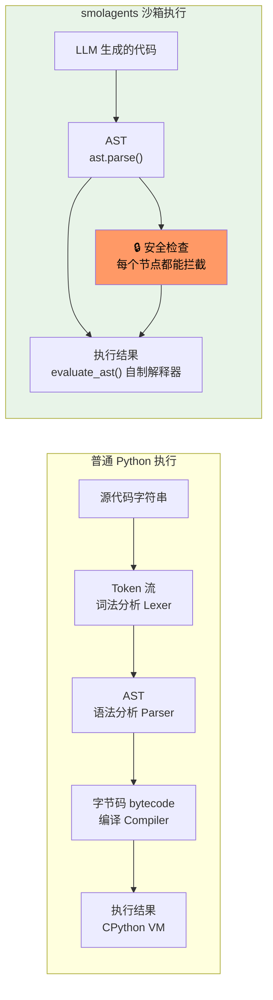
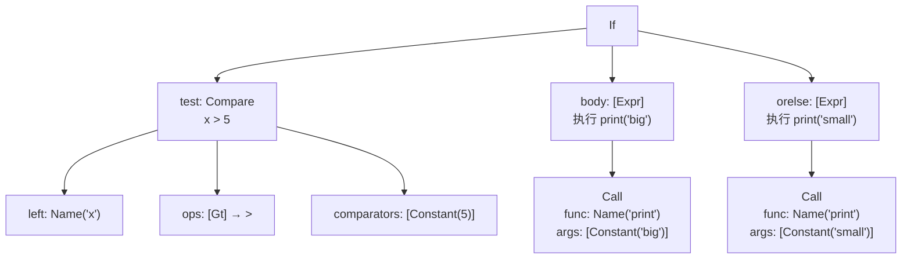
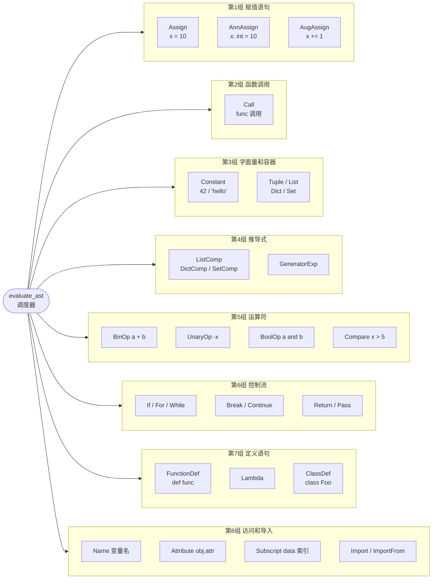
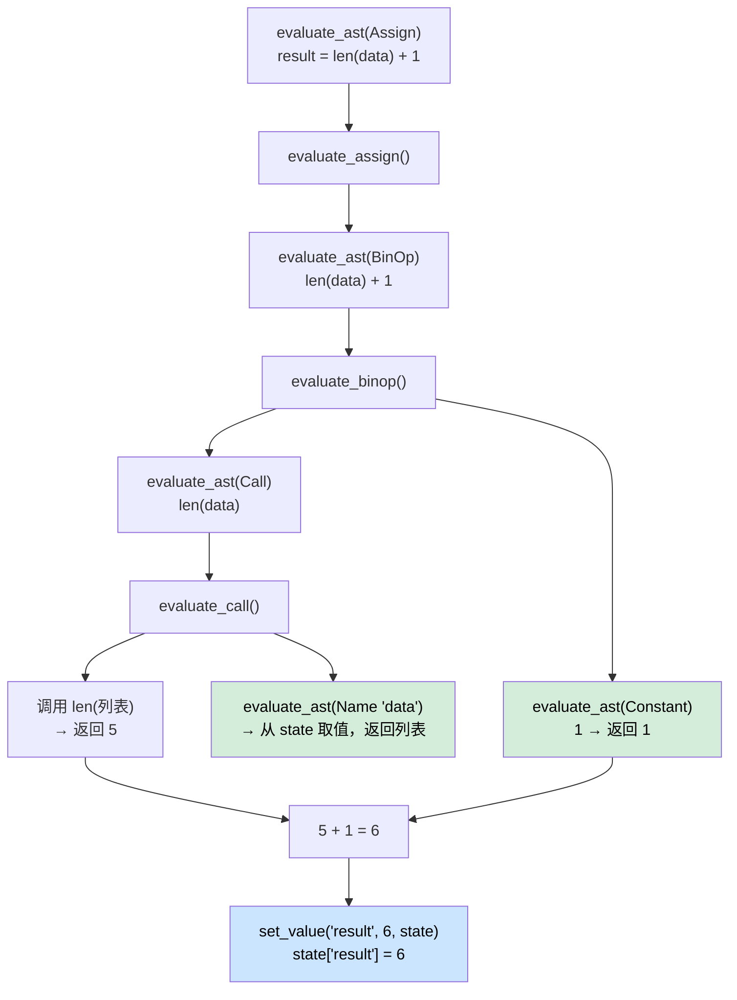
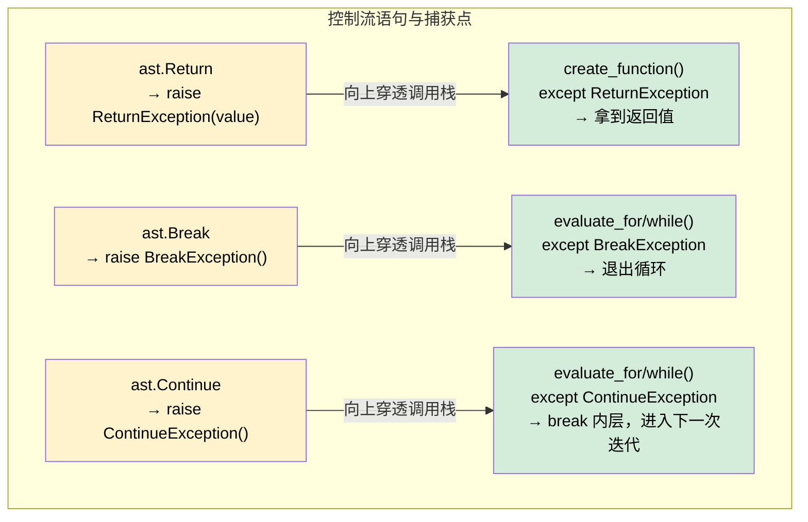
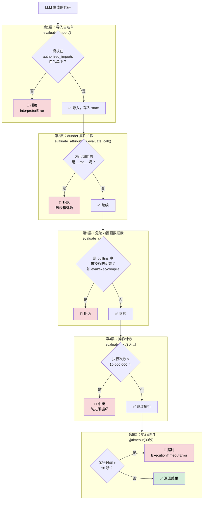
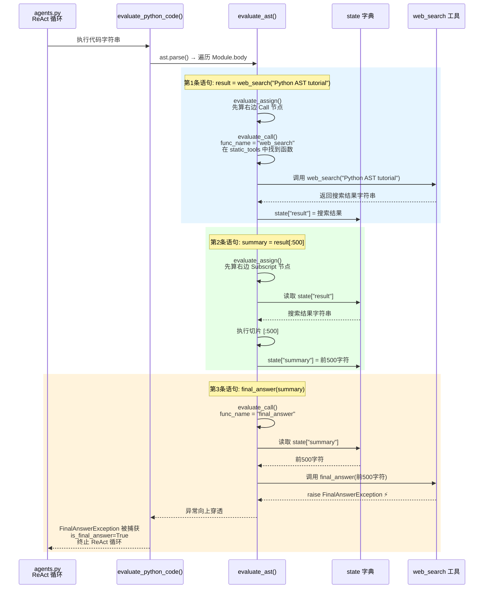

# Python AST（抽象语法树）深度学习指南

> AST树应该是语法检查，沙箱环境中很常用的结构，正好学到这里，结合 smolagents 的 `local_python_executor.py` 学习 AST 知识，
> 读完这个笔记，将理解为什么沙箱要用 AST，以及文件中每一个 `ast.xxx` 的含义。

---

## 目录

1. [什么是 AST？](#1-什么是-ast)
2. [Python 是怎么运行代码的？](#2-python-是怎么运行代码的)
3. [用 Python 亲手查看 AST](#3-用-python-亲手查看-ast)
4. [AST 节点完全分类](#4-ast-节点完全分类)
5. [核心概念：evaluate_ast 调度器](#5-核心概念evaluate_ast-调度器)
6. [逐类型详解：local_python_executor 用到的每个节点](#6-逐类型详解local_python_executor-用到的每个节点)
7. [AST 如何实现沙箱安全](#7-ast-如何实现沙箱安全)
8. [完整执行流程串讲](#8-完整执行流程串讲)
9. [动手练习](#9-动手练习)

---

## 1. 什么是 AST？

**AST（Abstract Syntax Tree，抽象语法树）** 是代码的"结构化表示"。

把一行代码想象成一句话：

```
result = len(data) + 1
```

人类读这句话，看到的是字符串。
编译器/解释器读这句话，会把它拆成一棵"树"：



这棵树就叫做 **抽象语法树（AST）**。

**为什么叫"抽象"？**
因为它抛弃了括号、空格、换行等排版细节，只保留代码的逻辑结构。
`len( data )+1` 和 `len(data) + 1` 的 AST 是完全一样的。

---

## 2. Python 是怎么运行代码的？

Python 正常执行代码分 3 步，smolagents 沙箱故意在第三步"插队"：



**为什么要自己解释 AST，而不是直接 `exec(code)`？**

因为 `exec()` 会交给 CPython 执行，无法拦截危险操作。
自己遍历 AST，可以在每一个节点上加安全检查：
- 遇到 `import os`？拒绝！
- 遇到访问 `__class__`？拒绝！
- 遇到 `eval()`？拒绝！

这是整个沙箱的核心设计思想。

---

## 3. 用 Python 亲手查看 AST

动手是最好的学习方式。打开 Python 解释器，试试这几个例子：

### 3.1 查看简单表达式的 AST

```python
import ast

code = "result = len(data) + 1"
tree = ast.parse(code)
print(ast.dump(tree, indent=2))
```

输出（节选）：
```
Module(
  body=[
    Assign(
      targets=[Name(id='result', ctx=Store())],
      value=BinOp(
        left=Call(
          func=Name(id='len', ctx=Load()),
          args=[Name(id='data', ctx=Load())],
          keywords=[]),
        op=Add(),
        right=Constant(value=1)))],
  type_ignores=[])
```

你能看到：
- 最外层是 `Module`（一个模块/文件）
- `body` 是语句列表
- 第一条语句是 `Assign`（赋值）
- 赋值右边是 `BinOp`（二元运算）
- `BinOp` 里有 `left`、`op`、`right` 三个字段

### 3.2 查看 if 语句的 AST

```python
import ast

code = """
if x > 5:
    print("big")
else:
    print("small")
"""
tree = ast.parse(code)
print(ast.dump(tree, indent=2))
```

输出：
```
Module(
  body=[
    If(
      test=Compare(
        left=Name(id='x', ctx=Load()),
        ops=[Gt()],
        comparators=[Constant(value=5)]),
      body=[
        Expr(
          value=Call(
            func=Name(id='print', ctx=Load()),
            args=[Constant(value='big')],
            keywords=[]))],
      orelse=[
        Expr(
          value=Call(
            func=Name(id='print', ctx=Load()),
            args=[Constant(value='small')],
            keywords=[]))])],
  type_ignores=[])
```

对应的树形结构（方便对照理解）：



注意 `else` 分支存在 `orelse` 字段里，`elif` 也一样——`elif` 本质上是嵌套的 `If` 节点放进了上一个 `If` 的 `orelse` 里。

### 3.3 用 ast.unparse() 从 AST 还原代码

```python
import ast

code = "x = [i*2 for i in range(10) if i % 2 == 0]"
tree = ast.parse(code)

# 查看完整 AST 结构
print(ast.dump(tree, indent=2))
```

输出：
```
Module(
  body=[
    Assign(
      targets=[
        Name(id='x', ctx=Store())],
      value=ListComp(
        elt=BinOp(
          left=Name(id='i', ctx=Load()),
          op=Mult(),
          right=Constant(value=2)),
        generators=[
          comprehension(
            target=Name(id='i', ctx=Store()),
            iter=Call(
              func=Name(id='range', ctx=Load()),
              args=[Constant(value=10)],
              keywords=[]),
            ifs=[
              Compare(
                left=BinOp(
                  left=Name(id='i', ctx=Load()),
                  op=Mod(),
                  right=Constant(value=2)),
                ops=[Eq()],
                comparators=[Constant(value=0)])],
            is_async=0)]))],
  type_ignores=[])
```

```python
# 从 AST 还原回代码字符串
print(ast.unparse(tree))
# 输出: x = [i * 2 for i in range(10) if i % 2 == 0]
```

可以看到 `ListComp` 节点有两个核心字段：
- `elt`：每次迭代产生的元素表达式（这里是 `i * 2`）
- `generators`：一个 `comprehension` 列表，每个包含 `target`（循环变量）、`iter`（迭代对象）、`ifs`（过滤条件）

`ast.unparse()` 在 `local_python_executor.py` 的 `create_function()` 里就有用到：

```python
# local_python_executor.py 第 549 行
source_code = ast.unparse(func_def)  # 保存源码（用于调试）
```

---

## 4. AST 节点完全分类

Python 的 AST 节点分为以下几大类（`local_python_executor.py` 用到的都加了标注）：

### 4.1 语句节点（Statements）

语句是"做一件事"，没有返回值（或者说返回值是 `None`）。

| AST 节点 | 对应 Python 语法 | 文件中的处理函数 |
|---|---|---|
| `ast.Assign` | `x = 10` | `evaluate_assign()` |
| `ast.AnnAssign` | `x: int = 10` | `evaluate_annassign()` |
| `ast.AugAssign` | `x += 1` | `evaluate_augassign()` |
| `ast.If` | `if/elif/else` | `evaluate_if()` |
| `ast.For` | `for x in items:` | `evaluate_for()` |
| `ast.While` | `while condition:` | `evaluate_while()` |
| `ast.FunctionDef` | `def func():` | `evaluate_function_def()` |
| `ast.ClassDef` | `class Foo:` | `evaluate_class_def()` |
| `ast.Return` | `return value` | `raise ReturnException` |
| `ast.Break` | `break` | `raise BreakException` |
| `ast.Continue` | `continue` | `raise ContinueException` |
| `ast.Import` | `import json` | `evaluate_import()` |
| `ast.ImportFrom` | `from math import sqrt` | `evaluate_import()` |
| `ast.Try` | `try/except/finally` | `evaluate_try()` |
| `ast.Raise` | `raise ValueError(...)` | `evaluate_raise()` |
| `ast.Assert` | `assert x > 0` | `evaluate_assert()` |
| `ast.With` | `with open(...) as f:` | `evaluate_with()` |
| `ast.Delete` | `del x` | `evaluate_delete()` |
| `ast.Pass` | `pass` | 直接 `return None` |
| `ast.Expr` | 独立表达式语句（如 `func()` 单独一行） | 内部取 `.value` 处理 |

### 4.2 表达式节点（Expressions）

表达式是"计算出一个值"，有返回值。

| AST 节点 | 对应 Python 语法 | 文件中的处理函数 |
|---|---|---|
| `ast.Constant` | `42`, `"hello"`, `True`, `None` | 直接返回 `.value` |
| `ast.Name` | 变量名 `x`, `data`, `result` | `evaluate_name()` |
| `ast.Attribute` | `obj.attr`, `math.pi` | `evaluate_attribute()` |
| `ast.Subscript` | `data[0]`, `d["key"]` | `evaluate_subscript()` |
| `ast.Call` | `func(args)` | `evaluate_call()` |
| `ast.BinOp` | `a + b`, `x * y` | `evaluate_binop()` |
| `ast.UnaryOp` | `-x`, `not flag` | `evaluate_unaryop()` |
| `ast.BoolOp` | `a and b`, `x or y` | `evaluate_boolop()` |
| `ast.Compare` | `x > 5`, `a == b` | `evaluate_condition()` |
| `ast.IfExp` | `x if cond else y`（三元） | 内联处理 |
| `ast.Lambda` | `lambda x: x + 1` | `evaluate_lambda()` |
| `ast.Tuple` | `(1, 2, 3)` | 递归处理每个元素 |
| `ast.List` | `[1, 2, 3]` | 递归处理每个元素 |
| `ast.Dict` | `{"a": 1}` | 递归处理键值 |
| `ast.Set` | `{1, 2, 3}` | 递归处理每个元素 |
| `ast.ListComp` | `[x for x in items]` | `evaluate_listcomp()` |
| `ast.DictComp` | `{k: v for k, v in d}` | `evaluate_dictcomp()` |
| `ast.SetComp` | `{x for x in items}` | `evaluate_setcomp()` |
| `ast.GeneratorExp` | `(x for x in items)` | `evaluate_generatorexp()` |
| `ast.Starred` | `*args` 解包 | 取 `.value` 递归 |
| `ast.JoinedStr` | f-string `f"hello {name}"` | `evaluate_joinedstr()` |

### 4.3 运算符节点（Operators）

运算符本身是独立的节点，通过 `isinstance()` 判断类型来区分。

**二元运算符（`ast.BinOp` 的 `.op` 字段）：**

| AST 节点 | Python 运算符 |
|---|---|
| `ast.Add` | `+` |
| `ast.Sub` | `-` |
| `ast.Mult` | `*` |
| `ast.Div` | `/` |
| `ast.Mod` | `%` |
| `ast.Pow` | `**` |
| `ast.FloorDiv` | `//` |
| `ast.BitAnd` | `&` |
| `ast.BitOr` | `\|` |
| `ast.BitXor` | `^` |
| `ast.LShift` | `<<` |
| `ast.RShift` | `>>` |

**一元运算符（`ast.UnaryOp` 的 `.op` 字段）：**

| AST 节点 | Python 运算符 |
|---|---|
| `ast.USub` | `-x`（取负） |
| `ast.UAdd` | `+x`（取正） |
| `ast.Not` | `not x` |
| `ast.Invert` | `~x`（按位取反） |

**比较运算符（`ast.Compare` 的 `.ops` 列表）：**

| AST 节点 | Python 运算符 |
|---|---|
| `ast.Eq` | `==` |
| `ast.NotEq` | `!=` |
| `ast.Lt` | `<` |
| `ast.LtE` | `<=` |
| `ast.Gt` | `>` |
| `ast.GtE` | `>=` |
| `ast.Is` | `is` |
| `ast.IsNot` | `is not` |
| `ast.In` | `in` |
| `ast.NotIn` | `not in` |

### 4.4 上下文节点（Context）

`ast.Name`、`ast.Attribute`、`ast.Subscript` 都有一个 `ctx` 字段，表示这个节点是在被"读"还是被"写"：

| AST 节点 | 含义 | 例子 |
|---|---|---|
| `ast.Load` | 读取变量的值 | `x = data + 1`（右边的 `data`） |
| `ast.Store` | 存储/赋值 | `x = data + 1`（左边的 `x`） |
| `ast.Del` | 删除 | `del x` |

在 `evaluate_assign()` 里可以看到：左边的 `target` 会被 `set_value()` 处理（Store），右边的 `value` 会被 `evaluate_ast()` 计算（Load）。

---

## 5. 核心概念：evaluate_ast 调度器

`evaluate_ast()` 是整个文件的核心，在 `local_python_executor.py` 第 1620 行。

它的结构非常清晰，是一个大 `if/elif` 链，本质上是一个**调度器（Dispatcher）**。
所有节点类型按功能分为 8 组，每组对应一类 Python 语法：




```python
def evaluate_ast(expression, state, static_tools, custom_tools, authorized_imports):
    # 操作计数，防止无限循环
    state["_operations_count"]["counter"] += 1

    if isinstance(expression, ast.Assign):
        return evaluate_assign(expression, ...)
    elif isinstance(expression, ast.Call):
        return evaluate_call(expression, ...)
    elif isinstance(expression, ast.Constant):
        return expression.value          # 直接返回常量值
    elif isinstance(expression, ast.Name):
        return evaluate_name(expression, ...)
    # ... 以此类推，覆盖所有 AST 节点类型
```

**关键理解**：`evaluate_ast` 是**递归**的。

当处理 `result = len(data) + 1` 时，调用从树根向叶节点下钻，再把结果从叶节点向根节点层层返回：



> 绿色节点是**叶节点**（直接返回值），蓝色节点是**最终写入**。
> 每一次递归都是"往树的更深处走"，到达叶节点后再一层层向上返回，组合出最终结果。

---

## 6. 逐类型详解：local_python_executor 用到的每个节点

下面通过真实的代码片段，对照讲解每种节点的结构和文件中的处理方式。

### 6.1 ast.Assign —— 赋值语句

```python
x = 10
a, b = 1, 2          # 元组解包
x = y = 0            # 多目标赋值
```

**AST 结构：**
```
Assign
├── targets: [Name("x")]    ← 赋值目标列表（注意是列表！）
└── value: Constant(10)     ← 右边的值
```

**关键字段：**
- `targets`：赋值目标，是**列表**（因为 `x = y = 0` 有两个目标）
- `value`：右边的表达式（只有一个）

**文件中的处理（第 876 行）：**
```python
def evaluate_assign(assign, state, ...):
    result = evaluate_ast(assign.value, ...)  # 先算右边
    if len(assign.targets) == 1:
        set_value(assign.targets[0], result, ...)  # 存入 state
    else:
        # x = y = 10 → 同一个值赋给多个目标
        for tgt in assign.targets:
            set_value(tgt, result, ...)
```

---

### 6.2 ast.AugAssign —— 增量赋值

```python
x += 1
count -= 2
data *= 3
```

**AST 结构：**
```
AugAssign
├── target: Name("x")    ← 赋值目标（只有一个！）
├── op: Add()            ← 运算符
└── value: Constant(1)   ← 右边
```

注意 `AugAssign` 与 `Assign` 的区别：
- `Assign.targets` 是列表，`AugAssign.target` 是单个（没有 s）
- `AugAssign` 多了一个 `op` 字段

**文件中的处理（第 734 行）：** 先读当前值，计算新值，再写回。

---

### 6.3 ast.Call —— 函数调用

这是最复杂的节点，几乎所有有趣的操作都通过函数调用来完成。

```python
len(data)
obj.method(x, y)
func(*args, **kwargs)
(lambda x: x+1)(5)
```

**AST 结构（以 `len(data)` 为例）：**
```
Call
├── func: Name("len")    ← 被调用的函数
├── args: [Name("data")] ← 位置参数列表
└── keywords: []         ← 关键字参数列表
```

**AST 结构（以 `obj.method(x, key=1)` 为例）：**
```
Call
├── func: Attribute
│   ├── value: Name("obj")
│   └── attr: "method"
├── args: [Name("x")]
└── keywords: [keyword(arg="key", value=Constant(1))]
```

**文件中的处理（第 954 行）：**

`evaluate_call()` 按 `call.func` 的类型，分 5 种情况找到函数对象：
1. `ast.Name`：按优先级查 `state → static_tools → custom_tools → ERRORS`
2. `ast.Attribute`：先算出 `obj`，再 `getattr(obj, method_name)`
3. `ast.Call`：链式调用，先递归执行内层 Call 得到函数对象
4. `ast.Lambda`：先构造 lambda 函数对象
5. `ast.Subscript`：`funcs[0](args)` 这种形式

然后对参数逐个 `evaluate_ast()`，最后调用。

**安全检查**就插在"找到函数"和"调用函数"之间：
- 禁止调用未在 `static_tools` 中的 builtins（`compile`, `eval`, `exec`...）
- 禁止调用 dunder 方法（`__init__`, `__str__`, `__repr__` 除外）

---

### 6.4 ast.Name —— 变量名

```python
result   # 读取变量
x        # 读取变量
```

**AST 结构：**
```
Name
├── id: "result"       ← 变量名字符串
└── ctx: Load()        ← 上下文（读/写/删）
```

**文件中的处理（第 1114 行）：**

`evaluate_name()` 按优先级查找：
```python
if name.id in state:           # 1. 用户定义的变量
    return state[name.id]
elif name.id in static_tools:  # 2. 内置安全工具（len, print, etc.）
    return safer_func(static_tools[name.id], ...)
elif name.id in custom_tools:  # 3. 可覆盖的工具
    return custom_tools[name.id]
elif name.id in ERRORS:        # 4. 内置异常类（ValueError, etc.）
    return ERRORS[name.id]
else:
    raise InterpreterError(...)
```

注意：当以 Name 的形式取出 `static_tools` 中的函数时，会用 `safer_func()` 包装，确保该函数的返回值也不会是危险对象。

---

### 6.5 ast.Attribute —— 属性访问

```python
obj.name        # 读取属性
math.pi         # 模块属性
data.append(1)  # 调用方法（这里只是 Attribute，外层还有 Call）
```

**AST 结构（以 `obj.name` 为例）：**
```
Attribute
├── value: Name("obj")   ← 对象
├── attr: "name"         ← 属性名字符串
└── ctx: Load()
```

**文件中的处理（第 454 行）：**

```python
def evaluate_attribute(expression, state, ...):
    # 安全检查：禁止访问 dunder 属性
    if expression.attr.startswith("__") and expression.attr.endswith("__"):
        raise InterpreterError(f"Forbidden access to dunder attribute: {expression.attr}")
    # 先计算对象（递归）
    value = evaluate_ast(expression.value, ...)
    # 再取属性
    return getattr(value, expression.attr)
```

这里的安全检查非常关键：如果允许 `__class__.__bases__`，攻击者可以通过这种方式逃逸沙箱，访问到任意 Python 对象。

---

### 6.6 ast.Subscript —— 索引/切片

```python
data[0]          # 列表索引
d["key"]         # 字典键
matrix[1:3]      # 切片
```

**AST 结构（以 `data[0]` 为例）：**
```
Subscript
├── value: Name("data")   ← 被索引的对象
├── slice: Constant(0)    ← 索引/切片
└── ctx: Load()
```

**文件中的处理（第 1094 行）：**

先算对象，再算索引，最后 `value[index]`。
错误处理时还会用 `difflib.get_close_matches()` 给出拼写建议：
```
Could not index data with 'neme'. Maybe you meant one of these indexes: ['name']
```

---

### 6.7 ast.BinOp / ast.UnaryOp / ast.BoolOp / ast.Compare

这几个运算符节点的结构很相似：

```
BinOp              UnaryOp           Compare
├── left           ├── op            ├── left
├── op             └── operand       ├── ops: [op1, op2]
└── right                            └── comparators: [v1, v2]
```

**特别注意 `ast.Compare` 支持链式比较：**

```python
1 < x < 10
```

对应的 AST：
```
Compare
├── left: Constant(1)
├── ops: [Lt(), Lt()]
└── comparators: [Name("x"), Constant(10)]
```

这是 Python 独特的语法，`1 < x < 10` 等价于 `1 < x and x < 10`（且 `x` 只求值一次）。

文件中的 `evaluate_condition()` 就是这样实现的：逐对比较，短路返回 `False`。

---

### 6.8 ast.FunctionDef —— 函数定义

```python
def greet(name, greeting="Hello"):
    return f"{greeting}, {name}!"
```

**AST 结构：**
```
FunctionDef
├── name: "greet"              ← 函数名
├── args: arguments
│   ├── args: [arg("name"), arg("greeting")]   ← 形参
│   └── defaults: [Constant("Hello")]          ← 默认值（从右往左对齐）
├── body: [Return(...)]        ← 函数体语句列表
└── decorator_list: []         ← 装饰器
```

**文件中的处理（第 533 行）：**

`create_function()` 创建一个**闭包**，闭包内保存了函数体的 AST 节点。
每次调用这个闭包时，都通过 `evaluate_ast()` 逐语句执行函数体，不使用 `compile()` 或 `exec()`。

`return` 语句通过 `ReturnException` 异常传递返回值：
```python
# 在 evaluate_ast() 中：
elif isinstance(expression, ast.Return):
    raise ReturnException(evaluate_ast(expression.value, ...))

# 在 create_function() 中：
try:
    for stmt in func_def.body:
        evaluate_ast(stmt, ...)
except ReturnException as e:
    result = e.value   # ← 拿到返回值
```

用异常来模拟控制流，是因为 AST 解释器无法"跳出"当前的 Python 调用栈，而异常天然具有"向上穿透"的能力。`break`、`continue` 也用同样的模式：



---

### 6.9 ast.Import / ast.ImportFrom —— 导入语句

```python
import json
import numpy as np
from math import sqrt, ceil
from os.path import *        # 危险！会被拦截
```

**AST 结构（以 `import json as j` 为例）：**
```
Import
└── names: [alias(name="json", asname="j")]
```

**AST 结构（以 `from math import sqrt` 为例）：**
```
ImportFrom
├── module: "math"
└── names: [alias(name="sqrt", asname=None)]
```

**文件中的处理（第 1492 行）：**

```python
def evaluate_import(expression, state, authorized_imports):
    if isinstance(expression, ast.Import):
        for alias in expression.names:
            if check_import_authorized(alias.name, authorized_imports):
                raw_module = import_module(alias.name)      # 真正导入
                state[alias.asname or alias.name] = get_safe_module(raw_module, ...)
            else:
                raise InterpreterError(...)
```

安全检查在导入时就完成了，未经授权的模块直接抛异常，根本不会进入 `state`。

---

### 6.10 列表推导式 ast.ListComp

```python
[x * 2 for x in range(10) if x % 2 == 0]
```

**AST 结构：**
```
ListComp
├── elt: BinOp(Name("x") * Constant(2))    ← 每个元素的表达式
└── generators: [
        comprehension
        ├── target: Name("x")              ← 循环变量
        ├── iter: Call(range, [Constant(10)])  ← 迭代对象
        └── ifs: [Compare(x % 2 == 0)]    ← 过滤条件（可多个）
    ]
```

文件用递归函数 `_evaluate_comprehensions()` 处理嵌套推导式（如 `[x+y for x in a for y in b]`）。

---

## 7. AST 如何实现沙箱安全

现在把前面的知识串起来，看沙箱的安全机制是如何通过 AST 实现的。

沙箱一共有 **5 层防御**，每一层拦截不同类型的攻击：



### 7.1 导入白名单

在 `evaluate_import()` 入口处检查：

```python
if not check_import_authorized(alias.name, authorized_imports):
    raise InterpreterError(...)
```

因为所有 `import` 语句都对应 `ast.Import` 或 `ast.ImportFrom` 节点，`evaluate_ast()` 必然会路由到 `evaluate_import()`，安全检查无法绕过。

### 7.2 禁止 dunder 属性访问

在 `evaluate_attribute()` 入口处检查：

```python
if expression.attr.startswith("__") and expression.attr.endswith("__"):
    raise InterpreterError(...)
```

**为什么 dunder 属性危险？**

在普通 Python 中，你可以这样逃逸沙箱：
```python
# 这是一种经典的沙箱逃逸攻击
"".__class__.__bases__[0].__subclasses__()
# 通过字符串对象，找到 object 基类，再找所有子类...
# 其中会包含 os.system, subprocess 等危险函数
```

通过禁止访问 `__class__`、`__bases__`、`__subclasses__` 等 dunder 属性，彻底切断了这条攻击链。

### 7.3 禁止危险内置函数调用

在 `evaluate_call()` 中检查：

```python
if (inspect.getmodule(func) == builtins) and inspect.isbuiltin(func) and (func not in static_tools.values()):
    raise InterpreterError(...)
```

即使代码通过某种迂回方式（比如从列表中取出）拿到了 `eval` 的引用，调用时也会被拦截。

### 7.4 操作计数器防止无限循环

在 `evaluate_ast()` 入口处：

```python
if state["_operations_count"]["counter"] >= MAX_OPERATIONS:
    raise InterpreterError("Reached the max number of operations...")
state["_operations_count"]["counter"] += 1
```

每次递归调用 `evaluate_ast()` 都计数，超过 1000 万次就中断。
`evaluate_while()` 另外还有 `MAX_WHILE_ITERATIONS = 1,000,000` 的限制。

### 7.5 超时机制

`@timeout(MAX_EXECUTION_TIME_SECONDS)` 装饰器用 `ThreadPoolExecutor` 实现：

```python
with ThreadPoolExecutor(max_workers=1) as executor:
    future = executor.submit(func, *args, **kwargs)
    result = future.result(timeout=timeout_seconds)
    # 如果超时，抛出 ExecutionTimeoutError
```

用线程池而非 `signal.alarm`，是因为 Windows 不支持 `signal`，且 `signal` 只能在主线程使用。

---

## 8. 完整执行流程串讲

假设 LLM 生成了以下代码：

```python
result = web_search("Python AST tutorial")
summary = result[:500]
final_answer(summary)
```

下面用序列图展示各组件之间的协作过程：



---

## 9. 动手练习

### 练习 1：打印 AST 树

```python
import ast

snippets = [
    "x += 1",
    "a, b = func()",
    "[i**2 for i in range(10) if i % 2 == 0]",
    "def add(a, b=0): return a + b",
    "import json",
    "from math import sqrt",
]

for code in snippets:
    print(f"\n{'='*50}")
    print(f"代码: {code}")
    print(f"AST:")
    print(ast.dump(ast.parse(code), indent=2))
```

### 练习 2：理解节点类型判断

```python
import ast

code = "result = len(data) + 1"
tree = ast.parse(code)
stmt = tree.body[0]  # 第一条语句

print(type(stmt))                    # <class 'ast.Assign'>
print(isinstance(stmt, ast.Assign)) # True
print(type(stmt.value))              # <class 'ast.BinOp'>
print(type(stmt.value.op))          # <class 'ast.Add'>
print(type(stmt.value.left))        # <class 'ast.Call'>
print(stmt.value.left.func.id)      # 'len'
```

### 练习 3：写一个最小 AST 解释器

```python
import ast

def mini_eval(expression, variables=None):
    """只处理常量、变量名和加减法的最小解释器"""
    if variables is None:
        variables = {}

    if isinstance(expression, ast.Constant):
        return expression.value

    elif isinstance(expression, ast.Name):
        return variables[expression.id]

    elif isinstance(expression, ast.BinOp):
        left = mini_eval(expression.left, variables)
        right = mini_eval(expression.right, variables)
        if isinstance(expression.op, ast.Add):
            return left + right
        elif isinstance(expression.op, ast.Sub):
            return left - right

    raise ValueError(f"不支持的节点类型: {type(expression).__name__}")

# 测试
code = "x + y - 3"
tree = ast.parse(code, mode="eval")  # mode="eval" 解析单个表达式
result = mini_eval(tree.body, variables={"x": 10, "y": 5})
print(result)  # 12
```

### 练习 4：在文件中找对应

打开 `local_python_executor.py`，找到以下代码，对照本文理解：

1. 第 1620 行：`evaluate_ast()` 的 `if/elif` 调度链 → 对应本文第 5 节
2. 第 954 行：`evaluate_call()` → 对应本文 6.3 节
3. 第 533 行：`create_function()` → 对应本文 6.8 节，理解为什么用异常实现 return
4. 第 461 行：`evaluate_attribute()` 的 dunder 检查 → 对应本文 7.2 节

---

## 总结

| 概念 | 要点 |
|---|---|
| AST 是什么 | 代码的树形结构表示，舍弃排版保留逻辑 |
| 为什么用 AST | 能在每个节点上加安全检查，比 `exec()` 安全 |
| `ast.parse()` | 字符串 → AST 树 |
| `ast.dump()` | 可视化 AST 树（调试用） |
| `ast.unparse()` | AST 树 → 字符串 |
| `evaluate_ast()` | 递归调度器，按节点类型分发处理 |
| 节点类型 | 语句（Assign/If/For/...）+ 表达式（Call/Name/BinOp/...）+ 运算符（Add/Eq/...） |
| `isinstance()` 判断 | 判断节点类型的唯一方式，贯穿整个文件 |
| 异常模拟控制流 | `return → ReturnException`，`break → BreakException`，`continue → ContinueException` |
| 沙箱安全 | 通过 AST 拦截：导入检查 + dunder 拦截 + 危险函数拦截 + 操作计数 + 超时 |
