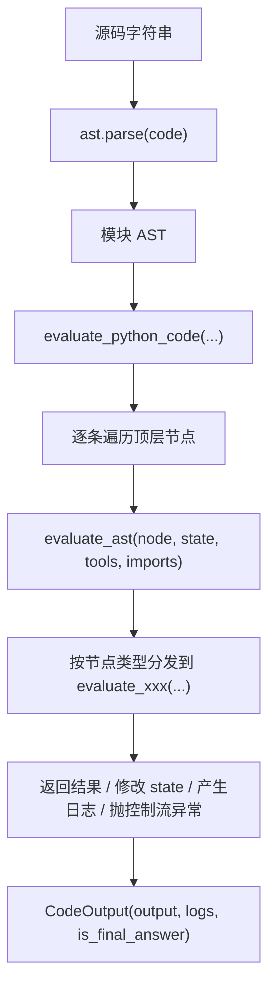
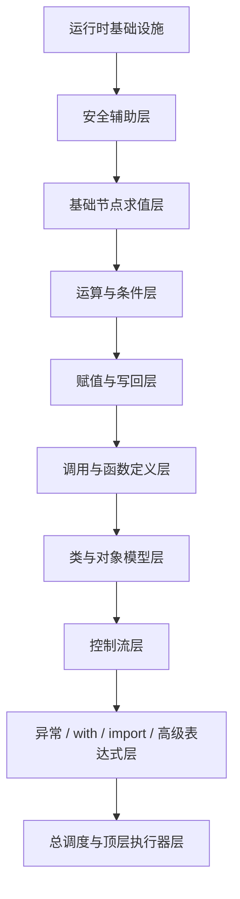
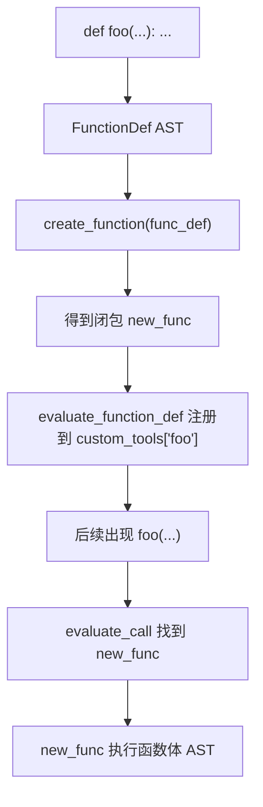
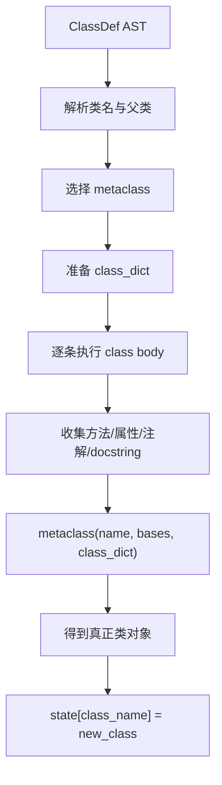
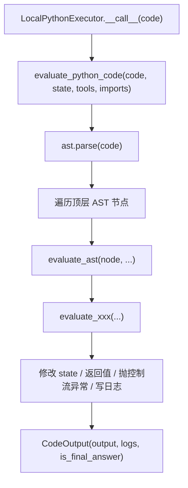
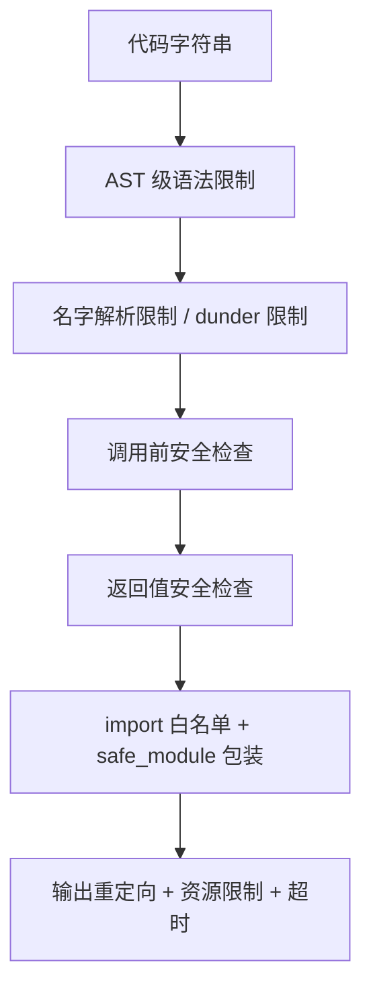

# Python AST-Walking Interpreter 实现笔记

> 范围：这份笔记以 `src/smolagents/local_python_executor.py` 为具体样本，但内容目标不是解释某个 Agent 业务流程，而是系统梳理“如何基于 Python AST 手写一个受限解释器/本地沙箱执行器”。  
> 定位：这是一份完整版本的知识笔记，覆盖该文件中涉及的运行时模型、安全模型、AST 节点语义、顶层执行流程、工程约束与和 CPython 的差异。

---

## 1. 先给结论：这个文件本质上是什么

这个文件本质上不是“`exec()` 的包装器”，而是一个：

**基于 Python 官方 AST 的、手写执行语义的、本地受限解释器**

也就是：

1. 先把源码交给 `ast.parse(...)` 解析成 AST。
2. 再不用 CPython 的默认执行路径直接跑它。
3. 改为自己遍历 AST。
4. 对每一种节点定义自己的执行规则。
5. 在执行过程中加入安全限制、输出收集、状态持久化和资源限制。

一句话概括：

**Python 负责把源码变成 AST；这个文件负责把 AST 变成可控的运行时行为。**

---

## 2. 它不是什么：不是 parser，不是字节码虚拟机

这点非常重要。

这个文件没有自己实现：

- 词法分析器
- 语法分析器
- Python 字节码编译器
- Python 虚拟机

它依赖的是：

```python
ast.parse(code)
```

也就是说：

- 源码 -> AST：交给 Python 官方解析器
- AST -> 执行结果：交给这个文件的 `evaluate_ast(...)`

所以更准确地叫法是：

**AST-walking interpreter / tree-walking interpreter**

而不是“完整的 Python 编译器”。

---

## 3. 为什么需要这种实现方式

如果直接：

```python
exec(code)
```

问题是执行过程完全进入 CPython 的默认执行模型，很难在语句和表达式级别接管行为。

而这类场景需要细粒度控制：

- 限制允许的 import。
- 禁止危险 builtin。
- 禁止 dunder 访问。
- 控制 `print()` 的去向。
- 限制最大执行时间和循环次数。
- 保留跨步骤的状态。
- 给 LLM 生成代码提供“可控”的 Python 子集。

AST 解释器的优势就在于：

**每经过一个语法节点，系统都能插一层控制逻辑。**

---

## 4. 整体执行流程

先把全局链路建立起来。



在这个文件里，最重要的入口是三层：

1. `LocalPythonExecutor.__call__`
2. `evaluate_python_code(...)`
3. `evaluate_ast(...)`

这三层的角色分别是：

- `LocalPythonExecutor`：执行器门面，维护跨步骤状态与工具注入。
- `evaluate_python_code`：单次代码执行控制器。
- `evaluate_ast`：节点分发器，是整个 AST 解释器的中心。

---

## 5. 运行时模型：解释器在执行时到底维护什么

一个 AST 解释器要能工作，必须维护自己的运行时对象模型。

### 5.1 `state`

`state` 可以理解成解释器的“变量环境”或“名字空间”。

作用：

- 保存普通变量。
- 保存已导入模块。
- 保存类对象。
- 保存运行期中间状态。
- 支持跨多次调用持久化。

例如：

```python
state = {
    "__name__": "__main__",
    "x": 1,
    "Person": <class Person>,
}
```

在这个实现里，`LocalPythonExecutor.state` 是跨 step 保留的，所以它不是一次性 `locals()`，而是一个可持久化的解释器环境。

### 5.2 `static_tools`

`static_tools` 是“受保护的可调用对象集合”。

典型内容：

- 内置的安全函数子集
- Agent 注入的工具
- 特殊工具，例如 `final_answer`

它和普通变量环境的区别是：

- 这些名字通常不允许被用户代码覆盖
- 这些函数的返回值往往还会走额外安全检查

### 5.3 `custom_tools`

`custom_tools` 主要承接运行时创建出来的自定义函数。

最典型的来源就是：

```python
def foo(...): ...
```

这类定义不会立刻写回 `state`，而是会被注册到 `custom_tools` 中，供后面的 `evaluate_call(...)` 解析调用。

### 5.4 `authorized_imports`

这是 import 白名单。

作用：

- 决定哪些模块允许导入
- 决定返回的模块对象是否安全
- 决定模块结果检查是否放行

### 5.5 `PrintContainer`

这是一个专门收集 `print()` 输出的可变容器。

它存在的原因是：

- 解释器不想让用户代码直接写终端
- 但又需要把用户输出保留下来

所以运行时会把：

```python
print("hello")
```

转成：

```python
state["_print_outputs"] += "hello\n"
```

### 5.6 控制流异常对象

这个解释器用异常模拟语言控制流：

- `BreakException`
- `ContinueException`
- `ReturnException`
- `FinalAnswerException`

它们不是“失败”，而是解释器内部的跳转机制。

---

## 6. 顶层安全模型：它是如何把“可执行 Python”变成“可控 Python”的

这类文件最关键的不是“能跑”，而是“能安全、可控地跑”。

这个文件的安全模型可以分成 7 层。

### 6.1 白名单 import

只有在 `authorized_imports` 中的模块才允许导入。

### 6.2 危险模块/危险函数限制

存在显式危险对象名单，例如：

- `os`
- `sys`
- `subprocess`
- `eval`
- `exec`

### 6.3 dunder 限制

典型限制：

- 不允许访问 `__class__`、`__mro__`、`__bases__` 这类反射入口
- 不允许随便调用 dunder 方法

这是一类典型的 Python 沙箱防御手段。

### 6.4 返回值检查

这个点特别重要：

**不仅入口要安全，返回值也要安全。**

即使调用的是“看起来安全”的函数，如果它返回了危险函数引用、危险模块引用，也要拦住。

### 6.5 输出重定向

`print()` 不直出终端，而是写入日志容器。

### 6.6 资源限制

包括：

- 最大操作数
- 最大循环次数
- 执行超时
- 输出长度上限

### 6.7 特殊退出语义

例如 `final_answer(...)` 这类函数会触发解释器级别的提前终止，而不是普通函数返回。

---

## 7. 整个文件的分层结构

如果脱离源码顺序，按解释器职责重新分层，这个文件大致可以这样看：



下面的笔记也按这个结构展开。

---

## 8. 基础设施层：不直接对应 AST 节点，但整套解释器离不开

### 8.1 `InterpreterError`

这是解释器统一错误类型。

它的意义是：

- 把“语义不支持”“安全禁止”“执行包装错误”统一收口为解释器自己的异常
- 不直接把所有 Python 原生异常原样抛给上层

### 8.2 `ERRORS`

这是对 Python 内置异常类的收集。

作用：

- 允许用户代码中直接写 `ValueError`、`TypeError` 等异常名
- 支持 `raise ValueError(...)` 和 `except ValueError`

### 8.3 `custom_print(...)`

这是一个占位函数。

它本身几乎不做事，但名字会被放进安全工具集合里。  
真正的 `print` 重定向逻辑是在 `evaluate_call(...)` 里做的。

### 8.4 `nodunder_getattr(...)`

安全版 `getattr`。

语义是：

- 正常属性可以取
- 双下划线属性一律禁止

这类函数常用于防止反射逃逸。

### 8.5 `check_safer_result(...)`

这是整个安全模型里非常关键的一层。

它检查返回值是否是：

- 未授权模块
- 模块字典
- 危险函数引用

这说明解释器的安全设计不是“只检查调用”，而是“调用和结果都检查”。

### 8.6 `safer_eval(...)`

装饰 AST evaluator 的安全包装器。

调用逻辑：

1. 执行原 evaluator
2. 检查返回值
3. 再返回

### 8.7 `safer_func(...)`

装饰普通函数/工具函数的安全包装器。

作用与 `safer_eval(...)` 类似，只是对象不是 AST evaluator，而是可调用对象。

### 8.8 `PrintContainer`

这是收集输出的运行时容器。

它支持：

- `append`
- `+=`
- `str()`
- `len()`

让 `print()` 输出可以像日志一样被汇总。

### 8.9 控制流异常

#### `BreakException`

模拟 `break`

#### `ContinueException`

模拟 `continue`

#### `ReturnException`

模拟 `return`

这些异常不是失败，而是语言跳转。

### 8.10 `ExecutionTimeoutError` 和 `timeout(...)`

这层负责执行超时控制。

当前实现用的是：

- `ThreadPoolExecutor`
- `future.result(timeout=...)`

要注意一个工程事实：

**超时意味着调用方停止等待，不一定意味着底层执行线程被真正杀死。**

### 8.11 `get_iterable(...)`

把对象转成可迭代结果。

常用于循环或推导式辅助。

### 8.12 `fix_final_answer_code(...)`

这是一个很工程化的函数。

目的不是语言语义，而是修补模型常见坏习惯：

- 避免把 `final_answer` 当作普通变量名覆盖掉特殊工具函数

### 8.13 import 相关辅助函数

#### `build_import_tree(...)`

把白名单导入路径构造成树。

#### `check_import_authorized(...)`

检查某个导入路径是否被允许。

#### `get_safe_module(...)`

构造模块的“安全副本”，防止原始模块对象内部藏有危险对象引用。

---

## 9. 解释器总调度器：`evaluate_ast(...)`

`evaluate_ast(...)` 是整个 AST-walking interpreter 的中心。

它本质上是一个大型分发器：

```python
if isinstance(node, ast.Assign):
    ...
elif isinstance(node, ast.Call):
    ...
elif isinstance(node, ast.ClassDef):
    ...
```

它的职责不是完成所有细节，而是：

- 根据节点类型选择语义处理器
- 统一做操作计数
- 统一经过安全返回值检查

### 9.1 `@safer_eval`

`evaluate_ast` 被 `@safer_eval` 包装，意味着：

- 每个节点求值结果返回前都会过一次安全检查

### 9.2 操作计数器

它会在每次节点求值时递增：

- 防止解释器在超深递归或巨量节点遍历中无限消耗

### 9.3 它支持哪些节点

从 `evaluate_ast(...)` 的分发表可以直接得到“当前解释器支持的语法范围”。

支持的大类包括：

- 赋值与写回
- 调用
- 字面量与容器
- 推导式和生成器
- 运算和比较
- 控制流
- 函数与类定义
- 名字解析与属性/下标访问
- f-string
- import
- try/raise/assert
- with
- delete

不在分发表里的节点，一般直接抛：

```python
InterpreterError(f"{node_type} is not supported.")
```

所以这份 AST 解释器本质上定义的是：

**一个“明确支持项列表”的 Python 子集。**

---

## 10. 基础值与引用：表达式节点的基础语义

### 10.1 `ast.Constant`

对应：

```python
1
"hello"
True
None
```

语义最简单：直接返回 `expression.value`。

### 10.2 `ast.Tuple` / `ast.List` / `ast.Dict` / `ast.Set`

这些节点的共同特点是：

- 自己不复杂
- 但内部元素都要递归求值

例如字典：

```python
{"a": x + 1}
```

不是原样返回，而是要先算：

- key
- value

### 10.3 `ast.Name`

对应：

```python
x
print
ValueError
```

这是解释器里的名字解析器。

查找顺序通常是：

1. `state`
2. `static_tools`
3. `custom_tools`
4. 内置异常类
5. 相似名字兜底匹配

它决定了一个名字到底代表：

- 变量
- 工具函数
- 用户自定义函数
- 异常类

### 10.4 `ast.Attribute`

对应：

```python
obj.name
math.sqrt
user.profile.city
```

执行模型：

1. 先递归求值点号左边对象
2. 再取右边属性名
3. 调 `getattr(...)`

常见安全约束：

- 禁止访问 dunder 属性

### 10.5 `ast.Subscript`

对应：

```python
arr[0]
mapping["name"]
text[1:3]
```

执行模型：

1. 求值被索引对象
2. 求值索引或切片
3. 执行 `value[index]`

如果失败，会把：

- `KeyError`
- `IndexError`
- `TypeError`

统一包装成 `InterpreterError`。

### 10.6 `ast.Slice`

对应：

```python
1:3
::2
```

它最终会被翻译成真正的 Python `slice(...)` 对象，再供 `Subscript` 使用。

### 10.7 `ast.Expr`

对应“表达式语句”。

例如：

```python
print(x)
foo()
"docstring"
```

这类节点本身只是语句壳，解释器通常会剥掉外层，递归求值里面的 `value`。

---

## 11. 运算与条件：值是怎么被算出来的

### 11.1 `ast.UnaryOp`

对应：

```python
-x
+x
not x
~x
```

解释器先算操作数，再按操作符类型分支。

### 11.2 `ast.BinOp`

对应：

```python
a + b
x * y
m // n
```

解释器的模式很固定：

1. 先求左值
2. 再求右值
3. 再根据操作符类型做具体运算

支持哪些运算，就由 `evaluate_binop(...)` 明确写出来。

### 11.3 `ast.BoolOp`

对应：

```python
a and b
x or y
```

这里有个非常关键的点：

**短路语义**

- `and` 返回第一个 falsy 值，若都 truthy 则返回最后一个值
- `or` 返回第一个 truthy 值，若都 falsy 则返回最后一个值

这个实现不是简单地把值转成 `True/False`，而是在尽量保留 Python 的返回值语义。

### 11.4 `ast.Compare`

对应：

```python
x > 1
a == b
1 < x < 10
```

关键点：

- Python 支持链式比较
- 所以解释器不能粗暴拆成无关布尔表达式

当前实现会把：

```python
1 < x < 10
```

按链式比较逐段执行，并在某一段失败时提前返回 `False`。

### 11.5 `ast.IfExp`

对应：

```python
x if cond else y
```

它是表达式，不是语句：

1. 先算条件
2. 条件真就算 `body`
3. 否则算 `orelse`

并且需要返回值。

---

## 12. 赋值体系：右值怎么落到左值上

### 12.1 `ast.Assign`

对应：

```python
x = 1
a, b = (1, 2)
x = y = 3
obj.name = "Tom"
```

核心模型：

1. 先求右值
2. 再把结果写入一个或多个目标

它本身更像“赋值流程控制器”。

### 12.2 `set_value(...)`

这个函数才是真正处理“左值写入”的核心。

它区分几类目标：

#### `ast.Name`

```python
x = 1
```

写入：

```python
state["x"] = 1
```

同时会防止覆盖 `static_tools` 中的名字。

#### `ast.Tuple`

```python
a, b = values
```

它会做解包，并递归调用 `set_value(...)`。

#### `ast.Subscript`

```python
arr[i] = value
```

转成：

```python
obj[key] = value
```

#### `ast.Attribute`

```python
obj.name = "Tom"
```

转成：

```python
setattr(obj, "name", value)
```

### 12.3 `ast.AnnAssign`

对应：

```python
x: int = 1
y: str
```

在这个解释器里，它的处理相对简洁：

- 如果有值，就求值并调用 `set_value(...)`
- 如果没有值，就返回 `None`

它并不是完整复刻 CPython 在所有上下文中的注解行为；在类体里更复杂的注解记录逻辑则由 `evaluate_class_def(...)` 自己处理。

### 12.4 `ast.AugAssign`

对应：

```python
x += 1
obj.count -= 1
arr[i] *= 2
```

比普通赋值多一层：

1. 先读出当前目标值
2. 再求右值
3. 应用操作符
4. 再写回原位置

所以 `AugAssign` 的难点不在运算，而在“读-改-写”三步连贯完成。

### 12.5 `ast.Delete`

对应：

```python
del x
del arr[i]
```

当前实现支持：

- 删除名字
- 删除下标项

不支持任意复杂 delete 目标。

---

## 13. 函数调用：`ast.Call` 为什么是解释器里最复杂的节点之一

### 13.1 `ast.Call` 处理的语法

```python
foo()
obj.method()
funcs[0]()
get_func()()
(lambda x: x + 1)(3)
```

### 13.2 它要解决的 4 个问题

1. 调用目标是什么
2. 调用目标怎么解析成真正函数对象
3. 参数怎么求值并绑定
4. 调用前后如何做安全处理

### 13.3 调用目标解析

它支持的主要目标形式有：

#### `ast.Name`

```python
foo()
print()
```

会在：

- `state`
- `static_tools`
- `custom_tools`
- `ERRORS`

之间按顺序查找。

#### `ast.Attribute`

```python
obj.method()
```

先算出 `obj`，再 `getattr(obj, "method")`。

#### `ast.Call`

```python
get_func()()
```

先执行里面一层调用，再把返回结果当作新的可调用对象。

#### `ast.Lambda`

```python
(lambda x: x + 1)(5)
```

先创建 lambda 对象，再调。

#### `ast.Subscript`

```python
funcs[0]()
```

先取出下标对象，再检查其是否可调用。

### 13.4 位置参数与关键字参数

解释器会把 AST 参数节点整理成真正的：

- `args`
- `kwargs`

并支持：

- 普通位置参数
- `*args` 展开
- 普通关键字参数
- `**kwargs` 展开

### 13.5 特殊处理：`super()`

`super()` 不能像普通函数那样简单调用，因为它依赖：

- 当前类
- 当前实例

所以解释器要从运行时状态中找：

- `state["__class__"]`
- `state["self"]`

来手工模拟无参 `super()` 的语义。

### 13.6 特殊处理：`print()`

`print()` 不真正输出到终端，而是：

```python
state["_print_outputs"] += "..."
```

这就是日志重定向落地的地方。

### 13.7 调用前安全检查

普通函数调用前还会检查：

- 是否调用了未授权 builtin
- 是否调用了危险 dunder 方法

这说明：

**拿到函数对象 != 自动允许调用**

---

## 14. 函数定义：`FunctionDef` 是怎么变成“以后可调用的函数”的

### 14.1 处理的语法

```python
def add(a, b=1):
    return a + b
```

对应 AST：

- `ast.FunctionDef`

### 14.2 `FunctionDef` 的核心语义

函数定义不是“现在就执行函数体”，而是：

**创建一个函数对象，并把名字绑定到这个对象上。**

这和原生 Python 的 `def` 语义一致。

### 14.3 `create_function(...)`

这是函数定义真正的核心。

它会把 `FunctionDef AST` 转成一个 Python 闭包 `new_func`。

为什么闭包适合这里？

因为它能天然“记住”：

- 原始函数 AST
- 定义时的 `state`
- 安全工具集合
- 白名单配置

所以函数定义在这个实现里就是：

```text
FunctionDef AST -> 闭包函数对象
```

### 14.4 参数绑定是手工模拟的

`new_func(*args, **kwargs)` 被调用后，它会自己做参数绑定。

主要步骤：

1. 提取形参名
2. 求默认值
3. 将默认值对齐到最后几个形参
4. 将位置参数写入局部环境
5. 将关键字参数写入局部环境
6. 处理 `*args`
7. 处理 `**kwargs`
8. 对缺失参数补默认值

### 14.5 一个实现取舍：`*args` 绑定

当前实现里，`*args` 的绑定方式更接近“拿到整份位置参数元组”，而不是严格切出“剩余参数”。

这说明：

- 它在大方向上模拟 Python 函数调用
- 但与 CPython 的严格参数绑定语义不完全一一对应

### 14.6 函数体执行

函数真正被调用时，解释器会：

1. 创建 `func_state`
2. 逐条遍历 `func_def.body`
3. 每条语句继续交给 `evaluate_ast(...)`

所以函数体不是原生 Python 直接跑的，而是：

**调用时再次进入 AST 解释系统**

### 14.7 `return` 为什么靠异常实现

当函数体里遇到：

```python
return x
```

它不会直接“从 Python 层函数返回”，而是抛：

```python
ReturnException(value)
```

然后由 `create_function(...)` 内部捕获并取值。

这是手写解释器里非常经典的技巧。

### 14.8 `evaluate_function_def(...)`

它的作用比较单纯：

1. 调用 `create_function(...)`
2. 把结果注册到 `custom_tools[func_name]`
3. 返回这个函数对象

也就是说：

- `create_function` 负责“造函数”
- `evaluate_function_def` 负责“注册函数名”

### 14.9 函数定义/调用完整链路



---

## 15. 类定义：`ClassDef` 是怎么变成真正类对象的

### 15.1 处理的语法

```python
class Person(Base):
    kind = "human"

    def greet(self):
        return "hi"
```

对应 AST：

- `ast.ClassDef`

### 15.2 类定义不是“一步到位”的

它通常分成四步：

1. 解析类名和父类
2. 选择 metaclass
3. 准备 `class_dict`
4. 执行类体，把结果写入 `class_dict`
5. 调用 `metaclass(name, bases, class_dict)` 创建类

### 15.3 解析父类

例如：

```python
class Dog(Animal, Pet):
```

解释器会先把 `Animal`、`Pet` 递归求值成真正类对象。

### 15.4 metaclass 选择

默认：

```python
metaclass = type
```

如果父类不是普通 `type` 创建的类，而是自定义 metaclass 创建的，就沿用那个父类 metaclass。

这是一种实用的、但比 CPython 原生规则更简化的策略。

### 15.5 `class_dict`

`class_dict` 是类体执行期间的临时类命名空间。

它承接类体里的：

- 方法
- 类属性
- docstring
- `__annotations__`

普通情况下：

```python
class_dict = {}
```

如果 metaclass 提供 `__prepare__`，则会用 metaclass 自定义的命名空间对象。

### 15.6 类体不是“自动生效”的

类体里每条语句都要手工翻译成对 `class_dict` 的修改。

#### `FunctionDef`

方法定义先被解释成普通函数对象，再写入：

```python
class_dict["method_name"] = function_object
```

#### `Assign`

普通类属性：

```python
class_dict["kind"] = "human"
```

#### `AnnAssign`

注解类属性会同时处理：

- `__annotations__`
- 可能的默认值

#### docstring

类体第一条如果是字符串常量，就写到：

```python
class_dict["__doc__"]
```

### 15.7 方法为什么先只是函数

类对象还没被真正创建出来之前，类方法并不是“绑定方法”，它们只是类命名空间里的函数值。

等类创建完成后，Python 的描述符机制才让它表现成实例方法。

### 15.8 类体中的属性赋值写到哪里

要区分三类左值：

#### `ast.Name`

```python
x = 1
```

写入顶层：

```python
class_dict["x"] = 1
```

#### `ast.Attribute`

```python
obj.attr = 1
```

不是新增 `class_dict["attr"]`，而是修改某个对象内部状态：

```python
obj.attr = 1
```

只要 `obj` 这个对象本身被类命名空间保留引用，这个修改就不会丢。

#### `ast.Subscript`

```python
mapping[key] = 1
```

是修改容器内部状态，而不是新增类顶层键。

### 15.9 真正造类

当类名、父类和 `class_dict` 都准备好之后，执行：

```python
new_class = metaclass(class_name, tuple(bases), class_dict)
```

普通情况下这几乎等价于：

```python
type(class_name, tuple(bases), class_dict)
```

### 15.10 注册类名

创建完成后：

```python
state[class_name] = new_class
```

这样后面代码里才能继续引用 `Person`、`Dog` 这些类名。

### 15.11 类定义完整流程图



---

## 16. 控制流：解释器如何接管执行顺序

### 16.1 `ast.If`

对应：

```python
if cond:
    ...
else:
    ...
```

执行步骤：

1. 先求值条件
2. 条件真走 `body`
3. 否则走 `orelse`
4. 返回最后一个非 `None` 的语句结果

### 16.2 `ast.For`

对应：

```python
for item in items:
    ...
```

执行步骤：

1. 求值迭代源
2. 逐个取值
3. 用 `set_value(...)` 把值绑定到循环目标
4. 执行循环体
5. 捕获 `BreakException` / `ContinueException`

### 16.3 `ast.While`

对应：

```python
while cond:
    ...
```

执行步骤：

1. 每轮重新求值条件
2. 执行循环体
3. 捕获 `break` / `continue`
4. 统计迭代次数，防止无限循环

### 16.4 `ast.Break`

转成：

```python
raise BreakException()
```

### 16.5 `ast.Continue`

转成：

```python
raise ContinueException()
```

### 16.6 `ast.Return`

转成：

```python
raise ReturnException(value)
```

### 16.7 `ast.Pass`

语义最简单：什么都不做。

控制流层最重要的启发是：

**手写解释器常常用异常模拟语言级跳转。**

---

## 17. 推导式与生成器：高级表达式的局部作用域

### 17.1 `_evaluate_comprehensions(...)`

这是推导式的核心辅助函数。

它的思想是：

- 递归处理多层 `for`
- 在每一轮上复制状态
- 在复制出的状态中绑定推导变量
- 检查 `if` 过滤条件
- 最后再求元素表达式

这非常像一个“小型、递归版 for 循环展开器”。

### 17.2 `ast.ListComp`

对应：

```python
[x * 2 for x in items if x > 0]
```

最终会把 `_evaluate_comprehensions(...)` 产生的元素收集成 `list`。

### 17.3 `ast.SetComp`

对应：

```python
{x for x in items}
```

收集成 `set`。

### 17.4 `ast.DictComp`

对应：

```python
{k: v for k, v in pairs}
```

每轮产生 `(key, value)`，再收集成字典。

### 17.5 `ast.GeneratorExp`

对应：

```python
(x for x in items)
```

这里的关键不是“循环”，而是：

**返回的是惰性的 generator，而不是立即展开后的列表。**

当前实现里会返回一个真正的 Python generator 对象。

### 17.6 为什么推导式常常复制状态

因为推导式中的目标变量不应随便污染外层作用域。

所以常见实现是：

- 每轮复制 `state`
- 在副本里绑定推导变量
- 在副本里执行条件和元素求值

这也是解释器处理中间局部作用域的一种典型方式。

---

## 18. 异常、断言和上下文管理器协议

### 18.1 `ast.Try`

对应：

```python
try:
    ...
except X as e:
    ...
else:
    ...
finally:
    ...
```

当前实现的主要步骤：

1. 执行 `body`
2. 如果抛异常，按 handler 顺序检查匹配
3. 如果 handler 有名字，就把异常对象写到 `state`
4. 执行匹配到的 except body
5. 如果没有异常，执行 `orelse`
6. 无论如何执行 `finalbody`

### 18.2 `ast.Raise`

对应：

```python
raise ValueError("bad")
raise exc from cause
```

实现要做的事：

- 求值异常对象
- 求值 cause
- 按 Python 语义抛出

当前实现不支持“无活动异常上下文下的裸 re-raise”。

### 18.3 `ast.Assert`

对应：

```python
assert x > 0
assert cond, "message"
```

当前实现：

1. 求值条件
2. 条件为假时抛 `AssertionError`
3. 如果没给消息，就用 `ast.unparse(...)` 把条件源码作为默认提示的一部分

### 18.4 `ast.With`

对应：

```python
with cm as value:
    ...
```

这是一个协议型节点，不只是普通控制流。

解释器要手工模拟：

1. 求值 `context_expr`
2. 调 `__enter__()`
3. 执行 `as` 绑定
4. 执行 body
5. 调 `__exit__(exc_type, exc, tb)`
6. 处理异常是否被 suppress

当前实现还支持多个 context manager，并按从内到外的顺序执行 `__exit__`。

---

## 19. import 系统：导入不仅是“能不能 import”

### 19.1 `build_import_tree(...)`

把导入白名单组织成层级树结构，方便支持：

- 顶层模块
- 子模块
- 通配项

### 19.2 `check_import_authorized(...)`

逐级检查一个导入路径是否被允许。

例如：

```python
numpy.linalg
```

不会简单看字符串是否相等，而是沿路径分段检查。

### 19.3 `evaluate_import(...)`

处理：

- `ast.Import`
- `ast.ImportFrom`

主要步骤：

1. 检查模块是否在白名单里
2. 真正导入原始模块
3. 通过 `get_safe_module(...)` 构造安全副本
4. 将模块或模块成员写入 `state`

### 19.4 `get_safe_module(...)`

这是 import 安全模型的关键点。

它不会把原始模块直接暴露给用户代码，而是：

1. 创建一个新模块壳
2. 遍历原模块属性
3. 对子模块递归清洗
4. 复制得到安全副本

这样做的目的，是防止用户通过“安全模块对象”继续爬到危险引用。

### 19.5 `import *`

这类实现通常还要处理：

- 如果模块定义了 `__all__`，导入 `__all__` 指定的名字
- 否则导入所有不以下划线开头的名字

这说明 import 语义本身就已经不简单，而一旦叠加安全要求就更复杂。

---

## 20. f-string、lambda 和其他表达式细节

### 20.1 `ast.Lambda`

对应：

```python
lambda x: x + 1
```

实现方式与普通函数类似，但更轻量：

- 直接返回一个闭包函数
- 调用时复制状态
- 绑定参数
- 对 lambda body 执行 `evaluate_ast(...)`

### 20.2 `ast.JoinedStr`

对应 f-string 外壳：

```python
f"hello {name}"
```

它会把所有片段拼起来。

### 20.3 `ast.FormattedValue`

对应 f-string 中的格式化片段：

```python
{value:.2f}
```

它会：

1. 求值表达式
2. 如果有 `format_spec`，再求值格式串
3. 最后调用 `format(...)`

---

## 21. 顶层执行器：`evaluate_python_code(...)`

这是单次执行整段代码的总控制器。

### 21.1 它做了什么

1. `ast.parse(code)` 解析源码
2. 初始化 `state`
3. 复制 `static_tools`
4. 初始化 `custom_tools`
5. 安装 `PrintContainer`
6. 安装操作计数器
7. 包装 `final_answer`
8. 遍历模块顶层节点
9. 逐个交给 `evaluate_ast(...)`
10. 统一收尾，返回 `(result, is_final_answer)`

### 21.2 语法错误处理

如果 `ast.parse(...)` 失败，会包装成 `InterpreterError`，并尽量带上：

- 行号
- 原始错误类型
- 出错源码片段

### 21.3 `final_answer` 的特殊包装

如果 `static_tools` 中存在 `final_answer`，当前实现会把它包一层：

- 先调用原工具
- 再抛 `FinalAnswerException`

这样调用：

```python
final_answer(x)
```

时，解释器会立刻结束整段执行，并把 `x` 当作最终答案返回。

### 21.4 顶层节点执行

它会遍历：

```python
expression.body
```

也就是模块顶层所有语句。

每个语句都会进入 `evaluate_ast(...)`。

### 21.5 正常返回与异常返回

正常情况下：

- 返回最后一个节点结果
- `is_final_answer = False`

如果捕获到 `FinalAnswerException`：

- 返回其值
- `is_final_answer = True`

如果捕获其他异常：

- 包装成 `InterpreterError`
- 关联出错的源码片段

### 21.6 输出收尾

无论正常还是异常，都会先把当前 `PrintContainer` 截断整理，再作为日志结果的一部分输出。

### 21.7 超时包装

如果配置了超时，会把整个 `_execute_code()` 再用 `timeout(...)` 包一层。

---

## 22. 执行器门面：`LocalPythonExecutor`

如果说 `evaluate_python_code(...)` 负责“单次执行”，那么 `LocalPythonExecutor` 负责“多次执行之间的管理”。

### 22.1 `CodeOutput`

单次执行的结果会被整理成：

```python
CodeOutput(
    output=...,
    logs=...,
    is_final_answer=...,
)
```

这三个字段分别表示：

- `output`：最后的求值结果或 `final_answer(...)` 的参数
- `logs`：本次执行期间收集到的 `print()` 输出
- `is_final_answer`：这次执行是否通过特殊退出路径结束

### 22.2 `PythonExecutor`

`PythonExecutor` 是抽象基类，它定义了执行器层应该提供的统一接口：

- `send_tools(...)`
- `send_variables(...)`
- `__call__(...)`

这说明从架构上看，AST 本地解释器只是“执行器实现之一”，理论上也可以有远程执行器、容器执行器、WASM 执行器等别的后端。

### 22.1 初始化时做什么

- 初始化 `custom_tools`
- 初始化持久化 `state`
- 合并导入白名单
- 检查授权模块是否已安装
- 保存超时、输出长度上限、额外函数等配置

### 22.3 `_check_authorized_imports_are_installed(...)`

这一步的作用是：

- 不要等运行时 import 才发现白名单模块根本没装
- 在执行器初始化时就提前报错

### 22.4 `send_tools(...)`

把外部工具、内置安全函数、额外函数合并成 `static_tools`。

也就是说，最终用户代码看到的“安全可调用对象集合”并不是单一来源，而是：

```python
Agent tools + BASE_PYTHON_TOOLS + additional_functions
```

### 22.5 `send_variables(...)`

把外部变量注入到持久化 `state` 中。

### 22.6 `__call__(code_action)`

它会调用 `evaluate_python_code(...)`，并把结果整理成：

```python
CodeOutput(output, logs, is_final_answer)
```

这说明执行器层主要负责：

- 配置与持久化
- 环境注入
- 单次执行结果封装

---

## 23. 支持语法总表：这个解释器到底接管了哪些 AST 节点

下面这张表可以当作整份文件的导航表。

| AST 节点 | 典型语法 | 主要处理函数 | 作用 |
| --- | --- | --- | --- |
| `Constant` | `1`, `"x"`, `True` | `evaluate_ast` 内联 | 返回常量值 |
| `Tuple` | `(a, b)` | `evaluate_ast` 内联 | 构造元组 |
| `List` | `[a, b]` | `evaluate_ast` 内联 | 构造列表 |
| `Dict` | `{"k": v}` | `evaluate_ast` 内联 | 构造字典 |
| `Set` | `{a, b}` | `evaluate_ast` 内联 | 构造集合 |
| `Name` | `x` | `evaluate_name` | 名字解析 |
| `Attribute` | `obj.attr` | `evaluate_attribute` | 属性访问 |
| `Subscript` | `obj[idx]` | `evaluate_subscript` | 下标/切片访问 |
| `Slice` | `1:3` | `evaluate_ast` 内联 | 构造 `slice` |
| `UnaryOp` | `-x` | `evaluate_unaryop` | 一元运算 |
| `BinOp` | `a + b` | `evaluate_binop` | 二元运算 |
| `BoolOp` | `a and b` | `evaluate_boolop` | 布尔短路运算 |
| `Compare` | `1 < x < 3` | `evaluate_condition` | 比较运算 |
| `Assign` | `x = y` | `evaluate_assign` | 普通赋值 |
| `AnnAssign` | `x: int = 1` | `evaluate_annassign` | 注解赋值 |
| `AugAssign` | `x += 1` | `evaluate_augassign` | 增量赋值 |
| `Delete` | `del x` | `evaluate_delete` | 删除名字/下标项 |
| `Call` | `foo()` | `evaluate_call` | 函数调用 |
| `Lambda` | `lambda x: x+1` | `evaluate_lambda` | lambda 闭包 |
| `FunctionDef` | `def f(): ...` | `evaluate_function_def` | 函数定义 |
| `ClassDef` | `class A: ...` | `evaluate_class_def` | 类定义 |
| `If` | `if ...` | `evaluate_if` | 分支控制 |
| `IfExp` | `x if c else y` | `evaluate_ast` 内联 | 三元表达式 |
| `For` | `for x in xs` | `evaluate_for` | for 循环 |
| `While` | `while c` | `evaluate_while` | while 循环 |
| `Break` | `break` | `evaluate_ast` 内联 | 通过异常跳出循环 |
| `Continue` | `continue` | `evaluate_ast` 内联 | 通过异常继续循环 |
| `Return` | `return x` | `evaluate_ast` 内联 | 通过异常返回 |
| `Pass` | `pass` | `evaluate_ast` 内联 | 空操作 |
| `ListComp` | `[x for x in xs]` | `evaluate_listcomp` | 列表推导式 |
| `SetComp` | `{x for x in xs}` | `evaluate_setcomp` | 集合推导式 |
| `DictComp` | `{k:v for ...}` | `evaluate_dictcomp` | 字典推导式 |
| `GeneratorExp` | `(x for x in xs)` | `evaluate_generatorexp` | 生成器表达式 |
| `Try` | `try ...` | `evaluate_try` | 异常流控制 |
| `Raise` | `raise e` | `evaluate_raise` | 抛异常 |
| `Assert` | `assert cond` | `evaluate_assert` | 断言 |
| `With` | `with cm as x` | `evaluate_with` | 上下文管理器协议 |
| `Import` / `ImportFrom` | `import x` | `evaluate_import` | 安全导入 |
| `JoinedStr` | `f"...{x}..."` | `evaluate_ast` 内联 | f-string 拼接 |
| `FormattedValue` | `{x:.2f}` | `evaluate_ast` 内联 | f-string 格式化 |
| `Expr` | `foo()` 作为语句 | `evaluate_ast` 内联 | 表达式语句外壳 |

---

## 24. 这套实现最值得记住的 10 个抽象

1. **解析和执行是两层。**  
   `ast.parse(...)` 负责结构；`evaluate_ast(...)` 负责语义。

2. **名字解析是运行时查表，不是源码替换。**  
   `ast.Name` 会在多个环境之间查找对象。

3. **属性访问和下标访问都是“先求左边，再访问右边”。**

4. **赋值总是“先算右边，再写左边”。**

5. **函数定义不会立刻执行函数体。**  
   `FunctionDef` 先变成闭包函数对象。

6. **函数调用和函数定义是两个完全不同的节点。**

7. **类定义也不是立刻成类，而是先收集 `class_dict` 再造类。**

8. **控制流异常不是错误，而是解释器内部跳转机制。**

9. **安全不只看入口，也看返回值。**

10. **一个真正能用的解释器，一定同时包含语言语义层和工程约束层。**

---

## 25. 和 CPython 的关系：一致、近似与差异

这类 AST 解释器通常既“像 Python”，又“不完全等于 Python”。

### 25.1 一致的地方

- 使用 Python 官方 AST
- 保留大量基础语法语义
- 函数定义/调用、类定义/实例化的总体模型与 Python 接近
- 支持 `try/with/import/f-string` 等多类真实语法

### 25.2 近似实现的地方

- 参数绑定规则未必 100% 与 CPython 相同
- metaclass 解析通常是简化版
- 类体支持的语句范围可能受限
- 某些注解和复杂左值场景可能只部分复刻

### 25.3 故意不一样的地方

- `print()` 被重定向
- import 受白名单约束
- 危险 builtin 被封锁
- dunder 属性/方法被限制
- 执行步数、时间、输出长度被限制

### 25.4 一个最关键的差异

CPython 大致是：

```text
源码 -> AST -> 字节码 -> 虚拟机执行
```

这里则是：

```text
源码 -> AST -> Python 代码递归解释 AST
```

所以这类实现天然更适合：

- 可控
- 可插钩
- 易于做安全策略

而不是追求：

- 完整 CPython 兼容性
- 极致执行性能

---

## 26. 为什么这个实现方式很通用

这套方法并不是只适合某一个项目，它在很多领域都非常通用：

- 教学型解释器
- 在线代码沙箱
- LLM 代码执行器
- 受限 Python DSL
- 审计型执行器
- 配置语言执行器

原因非常直接：

1. 省掉自己写 parser 的成本
2. 保留 Python 语法的自然表达能力
3. 可以在 AST 节点层精细插入控制逻辑
4. 可以借用 Python 自己的对象系统实现函数和类

所以这类实现通常被视为：

**“用 Python AST 做语法外壳，用自定义运行时做语义内核。”**

---

## 27. 推荐阅读顺序

如果以后继续精读同类文件，建议按这个顺序：

1. `evaluate_python_code(...)`
2. `evaluate_ast(...)`
3. `evaluate_name / evaluate_attribute / evaluate_subscript`
4. `evaluate_assign / set_value / evaluate_augassign`
5. `evaluate_call`
6. `create_function / evaluate_function_def`
7. `evaluate_class_def`
8. `evaluate_if / evaluate_for / evaluate_while`
9. 推导式和生成器
10. `evaluate_try / evaluate_with / evaluate_import`
11. 最后回头看安全辅助函数与资源限制

这个顺序的好处是：

- 先把解释器主干跑通
- 再理解局部语义
- 最后再回头总结工程层的防护与取舍

---

## 28. 最后一段总结

这整个文件展示了一种非常典型、非常实用的 AST-walking interpreter 实现思路：

- 用 `ast.parse(...)` 拿到结构化语法树
- 用 `evaluate_ast(...)` 接管运行时语义
- 用闭包实现函数定义
- 用 `class_dict + metaclass(...)` 实现类定义
- 用异常模拟 `return/break/continue/final_answer`
- 用白名单、结果检查、dunder 限制、超时和日志重定向构建可控沙箱
- 用执行器类把“单次解释执行”提升成“可跨步骤持久化的运行系统”

所以它不是简单地“执行 Python 代码”，而是在定义：

**一套可控的、受限的、可持续维护的 Python 运行时模型。**

---

## 29. 整体复盘：把这份文件重新压缩成一张脑图

如果已经逐段读过 `src/smolagents/local_python_executor.py`，最后最重要的不是再背每个函数名，而是把整份文件重新压缩成一个稳定的心智模型。

这一章就是这个“收官版复盘”。

### 29.1 先用一句话说清它到底是什么

这份文件不是“执行 Python 代码的一个小工具”，而是：

**一个基于官方 AST 的、手工定义运行语义的、本地受限 Python 解释器。**

它和直接 `exec(code)` 的本质区别是：

- `exec`：把执行权整体交给 CPython
- 本文件：先拿到 AST，再自己决定每个节点怎么执行

所以这份文件真正控制的不是“代码字符串”，而是：

**代码字符串被解析成 AST 之后的每一个运行时动作。**

### 29.2 最重要的三层执行链路

读到最后，必须牢牢记住这三层：

1. `LocalPythonExecutor`
2. `evaluate_python_code(...)`
3. `evaluate_ast(...)`

三者关系可以概括成：

- `LocalPythonExecutor`：对外门面，维护长期状态与工具环境
- `evaluate_python_code`：单次代码执行控制器
- `evaluate_ast`：节点分发中心

可以用下面这张图记住：



这意味着：

- `LocalPythonExecutor` 不负责节点语义
- `evaluate_python_code` 不负责每种语法细节
- `evaluate_ast` 不负责外部状态生命周期

每一层都有明确边界。

### 29.3 运行时模型：解释器到底维护了什么

这份文件的精髓之一，是它没有偷用 Python 自己的完整局部变量模型，而是维护了一套自己的运行时对象模型。

最关键的是：

- `state`
- `static_tools`
- `custom_tools`
- `authorized_imports`
- `PrintContainer`
- 控制流异常对象

其中最关键的是 `state`。

`state` 不是普通的临时字典，而是：

**整个解释器的变量环境 / 名字空间 / 跨 step 持久化存储。**

你可以这样理解：

- `x = 1` 最终通常落到 `state["x"] = 1`
- `import math` 最终通常落到 `state["math"] = safe_math`
- `class Person: ...` 最终通常落到 `state["Person"] = Person类对象`

而 `static_tools` / `custom_tools` 是解释器额外维护的“可调用对象区”：

- `static_tools`：安全、稳定、不可随便覆盖
- `custom_tools`：运行时动态定义出来的函数

这也是为什么这个解释器不是直接靠 Python 的 `globals()` / `locals()` 在跑。

### 29.4 这份文件的核心设计模式

如果把这份文件的方法论抽出来，它反复使用的是 4 个模式。

#### 模式 1：递归求子表达式，再组合结果

典型形态：

```python
left = evaluate_ast(node.left, ...)
right = evaluate_ast(node.right, ...)
return left + right
```

这就是 AST-walking interpreter 最经典的写法。

你在这些函数里都见过它：

- `evaluate_attribute`
- `evaluate_subscript`
- `evaluate_binop`
- `evaluate_condition`
- `evaluate_call`

#### 模式 2：把“流程控制”与“具体动作”拆开

典型例子：

- `evaluate_assign` 负责赋值流程
- `set_value(...)` 负责具体往哪里写

还有：

- `evaluate_function_def` 负责注册函数
- `create_function(...)` 负责真正造函数对象

这说明作者在实现解释器时，明确做了职责拆分，而不是把所有语义堆进一个大函数里。

#### 模式 3：用异常模拟语言级控制流

这份文件里有一组非常关键的内部异常：

- `BreakException`
- `ContinueException`
- `ReturnException`
- `FinalAnswerException`

它们不是错误，而是跳转机制。

也就是说，在这个解释器里：

- `return` 不是直接“函数返回”
- `break` 不是直接“跳出循环”
- `final_answer` 不是直接“结束 Agent”

而是：

**先抛异常，再由外层正确位置捕获，从而模拟语言级跳转。**

#### 模式 4：把定义语句变成运行时对象

这是最值得反复复盘的一点。

- `FunctionDef` 不会立刻执行函数体，而是变成闭包函数对象
- `ClassDef` 不会立刻成为类，而是先组装 `class_dict`，再交给 `metaclass(...)`

也就是：

- `def` -> 闭包函数对象
- `class` -> 类命名空间 + metaclass 创建

这正是解释器实现里最像“语言内核”的部分。

### 29.5 这份文件到底支持了哪些 Python 语义

如果从语义大类看，这份文件已经覆盖了一个相当完整的 Python 子集：

#### 1. 基础表达式

- 名字解析
- 属性访问
- 下标访问
- 一元运算
- 二元运算
- 布尔运算
- 比较运算

#### 2. 赋值体系

- 普通赋值
- 注解赋值
- 增量赋值
- 解包赋值
- 属性赋值
- 下标赋值

#### 3. 调用体系

- 普通函数调用
- 属性方法调用
- lambda 调用
- 调用结果再调用
- 下标结果调用
- `*args` / `**kwargs`

#### 4. 定义体系

- 函数定义
- 类定义
- 方法
- 类属性
- 注解属性

#### 5. 控制流

- `if / elif / else`
- `for`
- `while`
- `try / except / else / finally`
- `with`
- `raise`
- `assert`

#### 6. 复合表达式

- 列表推导式
- 集合推导式
- 字典推导式
- 生成器表达式

#### 7. 运行时配套能力

- `import`
- `del`
- `print` 输出收集
- `final_answer`

所以它绝对不是“只支持几种表达式的 toy demo”，而是一套已经能跑很多真实 LLM 生成代码的受限解释器。

### 29.6 这份文件最关键的安全模型到底是什么

安全不是单点完成的，而是多层叠加的。

可以把它复盘成下面这几层：



真正有安全意义的核心层包括：

- import 白名单
- dunder 限制
- 危险 builtin 拦截
- 返回值检查
- 输出重定向
- 操作数 / 循环 / 超时限制

其中 `get_safe_module(...)` 的意义要摆正：

- 它有用
- 但不是强隔离
- 它更像“模块暴露面整理层”

所以不能把这个文件误解成“完整沙箱”，更准确的说法是：

**它是一套受控执行系统，但不是操作系统级、进程级的物理隔离沙箱。**

### 29.7 这份文件和 CPython 的根本差异

学完之后，这个对比必须能说清。

CPython 的典型路径是：

```text
源码 -> AST -> 字节码 -> Python 虚拟机执行
```

而这个文件是：

```text
源码 -> AST -> 自己递归解释 AST
```

差异在于：

1. 它不生成字节码
2. 它不走 Python VM 的默认语义
3. 它在每个 AST 节点层都可以插入控制逻辑
4. 它大量借用 Python 自己的对象系统，但不借用默认执行路径

这就是为什么：

- 它很适合“可控执行”
- 但不适合追求“完整 CPython 兼容性”
- 也不适合追求极致性能

### 29.8 从学习角度，最该记住的几个“高价值理解”

如果未来你忘掉大量细节，只保留少数关键点，那么最值得记住的是下面这些。

#### 1. AST-walking interpreter 的核心不是 parse，而是语义接管

这个文件没有自己写 parser。  
真正值钱的是：

**把 AST 变成自己定义的运行时语义。**

#### 2. 函数和类是解释器实现里最像“语言内核”的部分

因为这里不再只是“算个表达式”，而是在自己构造：

- 函数对象
- 类对象
- 作用域
- 方法上下文

#### 3. 安全的关键不是单点，而是层层设防

单独看 `get_safe_module(...)`、单独看 `safer_eval(...)`、单独看 import 白名单，都不够。  
真正有效的是这些层同时存在。

#### 4. 这类解释器天然适合 LLM 代码执行场景

因为 LLM 代码执行要的不是“完全自由”，而是：

- 足够像 Python
- 但又能被系统接管
- 能限制 import
- 能收集输出
- 能在必要时中断或终止

这正是 AST-walking interpreter 的强项。

### 29.9 现在如果你要向别人讲这份文件，最短可以怎么讲

可以用下面这段话：

> `local_python_executor.py` 本质上实现了一个基于 Python 官方 AST 的本地受限解释器。它先用 `ast.parse()` 把代码变成语法树，再通过 `evaluate_ast()` 按节点类型分发到 `evaluate_xxx()`，手工实现表达式、赋值、调用、函数、类、控制流、import 等运行语义。同时它维护自己的运行时环境 `state/static_tools/custom_tools`，并通过白名单 import、dunder 限制、危险 builtin 检查、返回值检查、输出重定向和超时等机制，把“可执行 Python”收敛成“可控 Python”。最外层再由 `LocalPythonExecutor` 把这套能力封装成一个可跨 step 持久化使用的执行器对象。  

如果能顺畅讲出这段，基本就说明这份文件已经真正吃透了。

### 29.10 最后一句收官结论

把整份文件重新压缩成一句话：

**它不是在“运行一段 Python 代码”，而是在“实现一套可控的 Python 运行时”。**
