# smolagents 架构全解析

> 以架构师视角，从单文件内部结构到跨文件协作关系，完整梳理 smolagents 的设计。

---

## 目录

1. [整体架构鸟瞰](#1-整体架构鸟瞰)
2. [agents.py — Agent 核心](#2-agentspy--agent-核心)
3. [models.py — 模型抽象层](#3-modelspy--模型抽象层)
4. [tools.py — 工具系统](#4-toolspy--工具系统)
5. [memory.py — 记忆系统](#5-memorypy--记忆系统)
6. [local_python_executor.py — 本地沙箱](#6-local_python_executorpy--本地沙箱)
7. [remote_executors.py — 远程执行器](#7-remote_executorspy--远程执行器)
8. [跨文件协作：组件依赖全图](#8-跨文件协作组件依赖全图)
9. [ReAct 循环完整执行流程](#9-react-循环完整执行流程)
10. [ToolCallingAgent vs CodeAgent 对比](#10-toolcallingagent-vs-codeagent-对比)
11. [数据在各组件间的流动](#11-数据在各组件间的流动)
12. [初始化链路](#12-初始化链路)

---

## 1. 整体架构鸟瞰

smolagents 是一个实现 **ReAct（Reasoning + Acting）** 模式的轻量级 Agent 框架，整体分为 4 层：

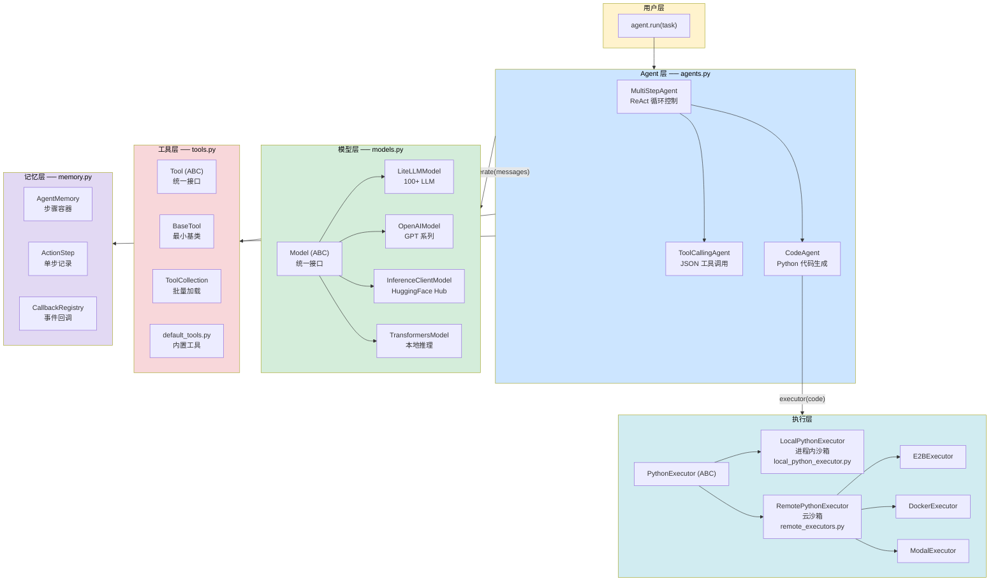
```mermaid
graph TB
    subgraph USER["用户层"]
        U["agent.run(task)"]
    end

    subgraph AGENT["Agent 层  ── agents.py"]
        MA["MultiStepAgent\nReAct 循环控制"]
        TCA["ToolCallingAgent\nJSON 工具调用"]
        CA["CodeAgent\nPython 代码生成"]
        MA --> TCA
        MA --> CA
    end

    subgraph MODEL["模型层  ── models.py"]
        M["Model (ABC)\n统一接口"]
        LLM1["LiteLLMModel\n100+ LLM"]
        LLM2["OpenAIModel\nGPT 系列"]
        LLM3["InferenceClientModel\nHuggingFace Hub"]
        LLM4["TransformersModel\n本地推理"]
        M --> LLM1
        M --> LLM2
        M --> LLM3
        M --> LLM4
    end

    subgraph TOOL["工具层  ── tools.py"]
        T["Tool (ABC)\n统一接口"]
        BT["BaseTool\n最小基类"]
        TC["ToolCollection\n批量加载"]
        DT["default_tools.py\n内置工具"]
    end

    subgraph MEM["记忆层  ── memory.py"]
        AM["AgentMemory\n步骤容器"]
        AS["ActionStep\n单步记录"]
        CR["CallbackRegistry\n事件回调"]
    end

    subgraph EXEC["执行层"]
        PE["PythonExecutor (ABC)"]
        LPE["LocalPythonExecutor\n进程内沙箱\nlocal_python_executor.py"]
        RPE["RemotePythonExecutor\n云沙箱\nremote_executors.py"]
        E2B["E2BExecutor"]
        DOC["DockerExecutor"]
        MOD["ModalExecutor"]
        PE --> LPE
        PE --> RPE
        RPE --> E2B
        RPE --> DOC
        RPE --> MOD
    end

    U --> AGENT
    AGENT -->|"model.generate(messages)"| MODEL
    AGENT -->|"tool.forward(args)"| TOOL
    AGENT -->|"append step"| MEM
    CA -->|"executor(code)"| EXEC

    style USER fill:#fff3cd,color:#000
    style AGENT fill:#cce5ff,color:#000
    style MODEL fill:#d4edda,color:#000
    style TOOL fill:#f8d7da,color:#000
    style MEM fill:#e2d9f3,color:#000
    style EXEC fill:#d1ecf1,color:#000
```

---

## 2. agents.py — Agent 核心

### 2.1 文件内部类结构

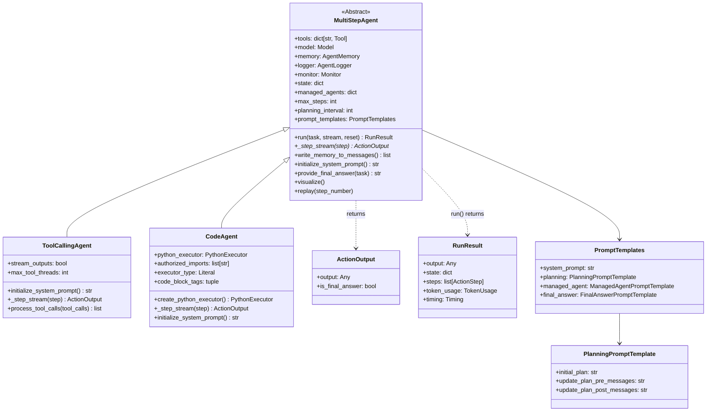
```mermaid
classDiagram
    class MultiStepAgent {
        <<Abstract>>
        +tools: dict[str, Tool]
        +model: Model
        +memory: AgentMemory
        +logger: AgentLogger
        +monitor: Monitor
        +state: dict
        +managed_agents: dict
        +max_steps: int
        +planning_interval: int
        +prompt_templates: PromptTemplates
        +run(task, stream, reset) RunResult
        +_step_stream(step)* ActionOutput
        +write_memory_to_messages() list
        +initialize_system_prompt() str
        +provide_final_answer(task) str
        +visualize()
        +replay(step_number)
    }

    class ToolCallingAgent {
        +stream_outputs: bool
        +max_tool_threads: int
        +initialize_system_prompt() str
        +_step_stream(step) ActionOutput
        +process_tool_calls(tool_calls) list
    }

    class CodeAgent {
        +python_executor: PythonExecutor
        +authorized_imports: list[str]
        +executor_type: Literal
        +code_block_tags: tuple
        +create_python_executor() PythonExecutor
        +_step_stream(step) ActionOutput
        +initialize_system_prompt() str
    }

    class ActionOutput {
        +output: Any
        +is_final_answer: bool
    }

    class RunResult {
        +output: Any
        +state: dict
        +steps: list[ActionStep]
        +token_usage: TokenUsage
        +timing: Timing
    }

    class PromptTemplates {
        +system_prompt: str
        +planning: PlanningPromptTemplate
        +managed_agent: ManagedAgentPromptTemplate
        +final_answer: FinalAnswerPromptTemplate
    }

    class PlanningPromptTemplate {
        +initial_plan: str
        +update_plan_pre_messages: str
        +update_plan_post_messages: str
    }

    MultiStepAgent <|-- ToolCallingAgent
    MultiStepAgent <|-- CodeAgent
    MultiStepAgent ..> ActionOutput : returns
    MultiStepAgent ..> RunResult : run() returns
    MultiStepAgent --> PromptTemplates
    PromptTemplates --> PlanningPromptTemplate
```

### 2.2 MultiStepAgent 的 run() 主循环

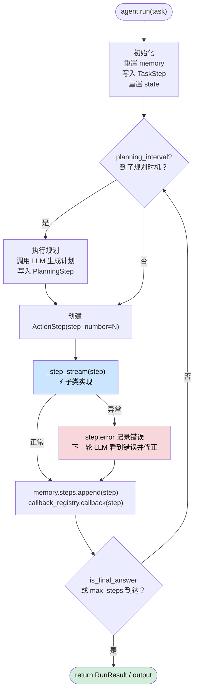
```mermaid
flowchart TD
    START(["agent.run(task)"])
    INIT["初始化\n重置 memory\n写入 TaskStep\n重置 state"]
    PLAN{"planning_interval?\n到了规划时机？"}
    DO_PLAN["执行规划\n调用 LLM 生成计划\n写入 PlanningStep"]
    STEP["创建 ActionStep(step_number=N)"]
    EXEC["_step_stream(step)\n⚡ 子类实现"]
    MEM["memory.steps.append(step)\ncallback_registry.callback(step)"]
    FINAL{"is_final_answer\n或 max_steps 到达？"}
    RETURN(["return RunResult / output"])
    ERROR["step.error 记录错误\n下一轮 LLM 看到错误并修正"]

    START --> INIT
    INIT --> PLAN
    PLAN -- 是 --> DO_PLAN --> STEP
    PLAN -- 否 --> STEP
    STEP --> EXEC
    EXEC -- 正常 --> MEM
    EXEC -- 异常 --> ERROR --> MEM
    MEM --> FINAL
    FINAL -- 否 --> PLAN
    FINAL -- 是 --> RETURN

    style EXEC fill:#cce5ff,color:#000
    style RETURN fill:#d4edda,color:#000
    style ERROR fill:#f8d7da,color:#000
```

---

## 3. models.py — 模型抽象层

### 3.1 消息数据结构（LLM 输入输出）

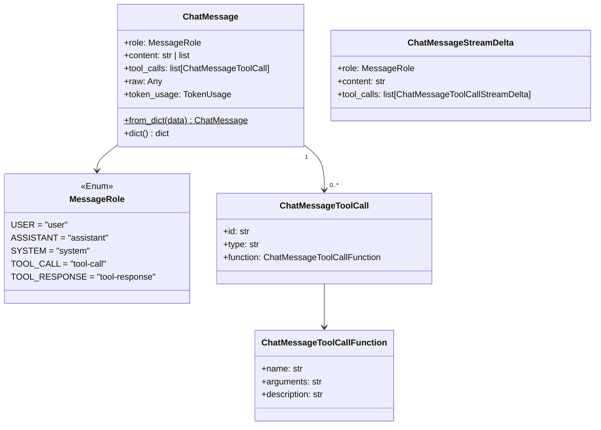
```mermaid
classDiagram
    class MessageRole {
        <<Enum>>
        USER = "user"
        ASSISTANT = "assistant"
        SYSTEM = "system"
        TOOL_CALL = "tool-call"
        TOOL_RESPONSE = "tool-response"
    }

    class ChatMessage {
        +role: MessageRole
        +content: str | list
        +tool_calls: list[ChatMessageToolCall]
        +raw: Any
        +token_usage: TokenUsage
        +from_dict(data) ChatMessage$
        +dict() dict
    }

    class ChatMessageToolCall {
        +id: str
        +type: str
        +function: ChatMessageToolCallFunction
    }

    class ChatMessageToolCallFunction {
        +name: str
        +arguments: str
        +description: str
    }

    class ChatMessageStreamDelta {
        +role: MessageRole
        +content: str
        +tool_calls: list[ChatMessageToolCallStreamDelta]
    }

    ChatMessage --> MessageRole
    ChatMessage "1" --> "0..*" ChatMessageToolCall
    ChatMessageToolCall --> ChatMessageToolCallFunction
```

### 3.2 Model 继承树

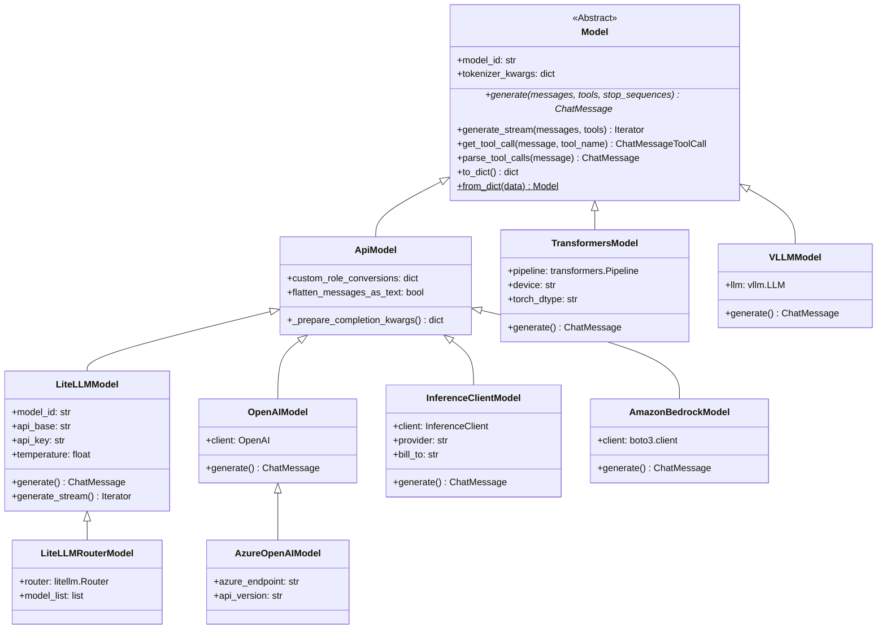
```mermaid
classDiagram
    class Model {
        <<Abstract>>
        +model_id: str
        +tokenizer_kwargs: dict
        +generate(messages, tools, stop_sequences)* ChatMessage
        +generate_stream(messages, tools) Iterator
        +get_tool_call(message, tool_name) ChatMessageToolCall
        +parse_tool_calls(message) ChatMessage
        +to_dict() dict
        +from_dict(data) Model$
    }

    class ApiModel {
        +custom_role_conversions: dict
        +flatten_messages_as_text: bool
        +_prepare_completion_kwargs() dict
    }

    class LiteLLMModel {
        +model_id: str
        +api_base: str
        +api_key: str
        +temperature: float
        +generate() ChatMessage
        +generate_stream() Iterator
    }

    class LiteLLMRouterModel {
        +router: litellm.Router
        +model_list: list
    }

    class OpenAIModel {
        +client: OpenAI
        +generate() ChatMessage
    }

    class AzureOpenAIModel {
        +azure_endpoint: str
        +api_version: str
    }

    class InferenceClientModel {
        +client: InferenceClient
        +provider: str
        +bill_to: str
        +generate() ChatMessage
    }

    class TransformersModel {
        +pipeline: transformers.Pipeline
        +device: str
        +torch_dtype: str
        +generate() ChatMessage
    }

    class VLLMModel {
        +llm: vllm.LLM
        +generate() ChatMessage
    }

    class AmazonBedrockModel {
        +client: boto3.client
        +generate() ChatMessage
    }

    Model <|-- ApiModel
    Model <|-- TransformersModel
    Model <|-- VLLMModel
    ApiModel <|-- LiteLLMModel
    ApiModel <|-- OpenAIModel
    ApiModel <|-- InferenceClientModel
    ApiModel <|-- AmazonBedrockModel
    LiteLLMModel <|-- LiteLLMRouterModel
    OpenAIModel <|-- AzureOpenAIModel
```

---

## 4. tools.py — 工具系统

### 4.1 工具类结构

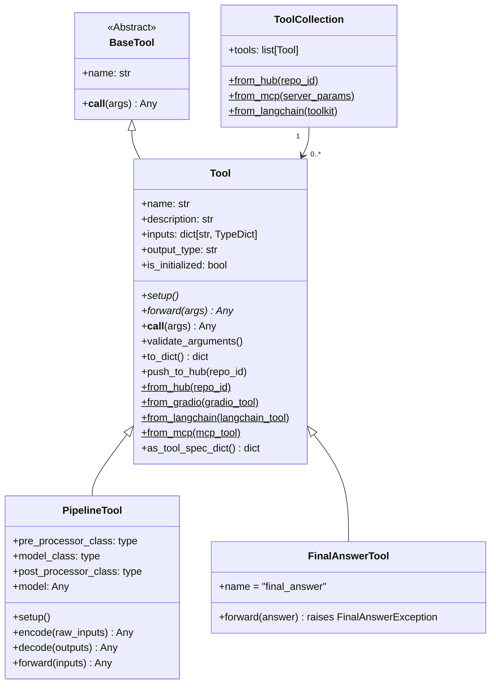
```mermaid
classDiagram
    class BaseTool {
        <<Abstract>>
        +name: str
        +__call__(args) Any
    }

    class Tool {
        +name: str
        +description: str
        +inputs: dict[str, TypeDict]
        +output_type: str
        +is_initialized: bool
        +setup()*
        +forward(args)* Any
        +__call__(args) Any
        +validate_arguments()
        +to_dict() dict
        +push_to_hub(repo_id)
        +from_hub(repo_id)$
        +from_gradio(gradio_tool)$
        +from_langchain(langchain_tool)$
        +from_mcp(mcp_tool)$
        +as_tool_spec_dict() dict
    }

    class ToolCollection {
        +tools: list[Tool]
        +from_hub(repo_id)$
        +from_mcp(server_params)$
        +from_langchain(toolkit)$
    }

    class PipelineTool {
        +pre_processor_class: type
        +model_class: type
        +post_processor_class: type
        +model: Any
        +setup()
        +encode(raw_inputs) Any
        +decode(outputs) Any
        +forward(inputs) Any
    }

    class FinalAnswerTool {
        +name = "final_answer"
        +forward(answer) raises FinalAnswerException
    }

    BaseTool <|-- Tool
    Tool <|-- PipelineTool
    Tool <|-- FinalAnswerTool
    ToolCollection "1" --> "0..*" Tool
```

### 4.2 Tool 的 inputs 格式与验证流程

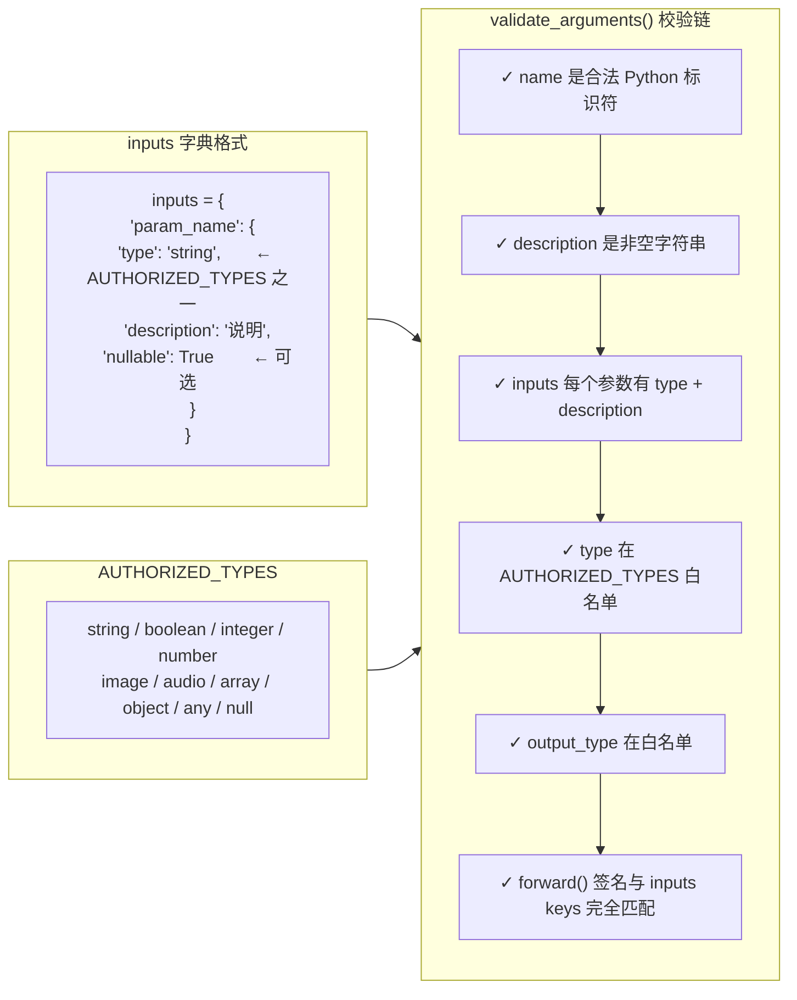
```mermaid
flowchart LR
    subgraph inputs_schema["inputs 字典格式"]
        IS["inputs = {
  'param_name': {
    'type': 'string',       ← AUTHORIZED_TYPES 之一
    'description': '说明',
    'nullable': True        ← 可选
  }
}"]
    end

    subgraph validate["validate_arguments() 校验链"]
        V1["✓ name 是合法 Python 标识符"]
        V2["✓ description 是非空字符串"]
        V3["✓ inputs 每个参数有 type + description"]
        V4["✓ type 在 AUTHORIZED_TYPES 白名单"]
        V5["✓ output_type 在白名单"]
        V6["✓ forward() 签名与 inputs keys 完全匹配"]
        V1 --> V2 --> V3 --> V4 --> V5 --> V6
    end

    subgraph types["AUTHORIZED_TYPES"]
        T["string / boolean / integer / number
image / audio / array / object / any / null"]
    end

    inputs_schema --> validate
    types --> validate
```

### 4.3 两种工具定义方式

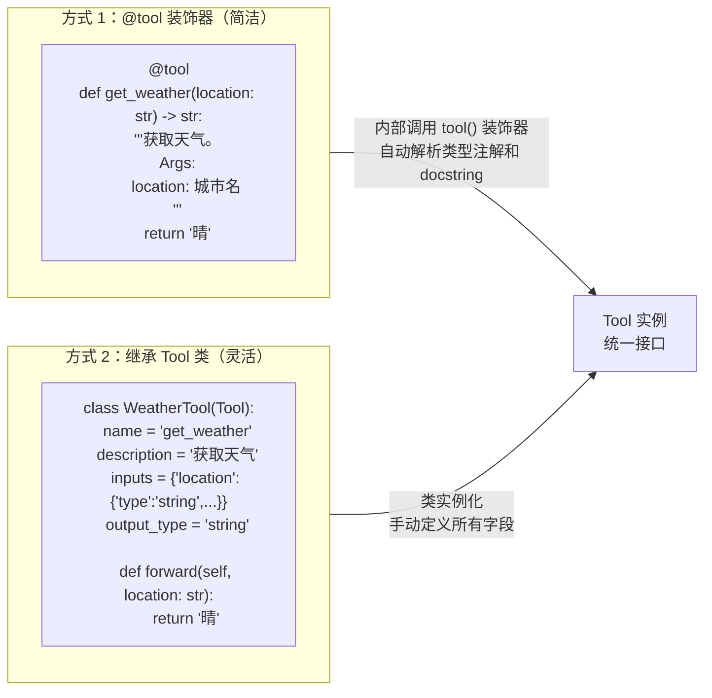
```mermaid
flowchart LR
    subgraph way1["方式 1：@tool 装饰器（简洁）"]
        D1["@tool
def get_weather(location: str) -> str:
    '''获取天气。
    Args:
        location: 城市名
    '''
    return '晴'"]
    end

    subgraph way2["方式 2：继承 Tool 类（灵活）"]
        D2["class WeatherTool(Tool):
    name = 'get_weather'
    description = '获取天气'
    inputs = {'location': {'type':'string',...}}
    output_type = 'string'

    def forward(self, location: str):
        return '晴'"]
    end

    way1 -->|"内部调用 tool() 装饰器\n自动解析类型注解和 docstring"| TOOL["Tool 实例\n统一接口"]
    way2 -->|"类实例化\n手动定义所有字段"| TOOL
```

---

## 5. memory.py — 记忆系统

### 5.1 记忆步骤层次结构

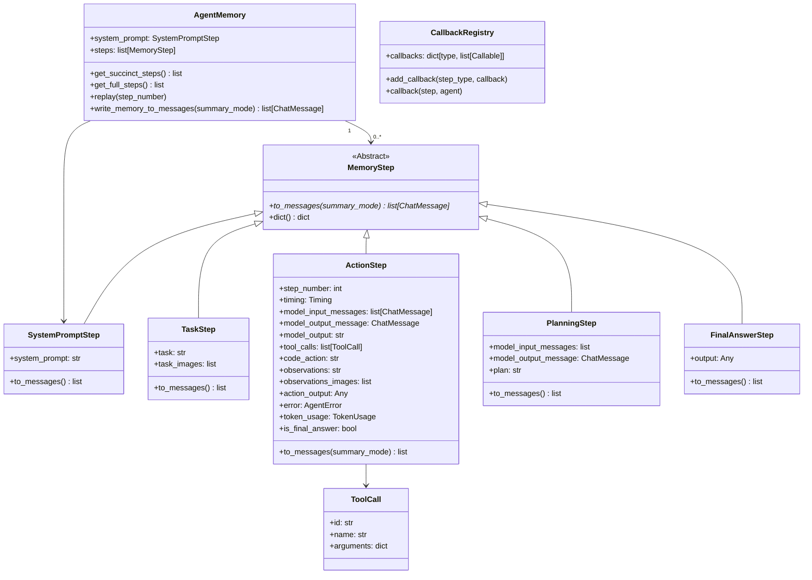
```mermaid
classDiagram
    class MemoryStep {
        <<Abstract>>
        +to_messages(summary_mode) list[ChatMessage]*
        +dict() dict
    }

    class SystemPromptStep {
        +system_prompt: str
        +to_messages() list
    }

    class TaskStep {
        +task: str
        +task_images: list
        +to_messages() list
    }

    class ActionStep {
        +step_number: int
        +timing: Timing
        +model_input_messages: list[ChatMessage]
        +model_output_message: ChatMessage
        +model_output: str
        +tool_calls: list[ToolCall]
        +code_action: str
        +observations: str
        +observations_images: list
        +action_output: Any
        +error: AgentError
        +token_usage: TokenUsage
        +is_final_answer: bool
        +to_messages(summary_mode) list
    }

    class PlanningStep {
        +model_input_messages: list
        +model_output_message: ChatMessage
        +plan: str
        +to_messages() list
    }

    class FinalAnswerStep {
        +output: Any
        +to_messages() list
    }

    class AgentMemory {
        +system_prompt: SystemPromptStep
        +steps: list[MemoryStep]
        +get_succinct_steps() list
        +get_full_steps() list
        +replay(step_number)
        +write_memory_to_messages(summary_mode) list[ChatMessage]
    }

    class ToolCall {
        +id: str
        +name: str
        +arguments: dict
    }

    class CallbackRegistry {
        +callbacks: dict[type, list[Callable]]
        +add_callback(step_type, callback)
        +callback(step, agent)
    }

    MemoryStep <|-- SystemPromptStep
    MemoryStep <|-- TaskStep
    MemoryStep <|-- ActionStep
    MemoryStep <|-- PlanningStep
    MemoryStep <|-- FinalAnswerStep
    ActionStep --> ToolCall
    AgentMemory "1" --> "0..*" MemoryStep
    AgentMemory --> SystemPromptStep
```

### 5.2 ActionStep 记录的内容（ReAct 三阶段）

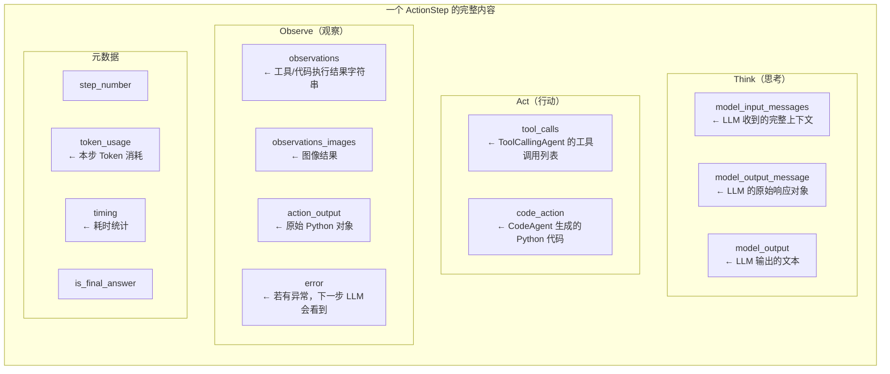
```mermaid
flowchart LR
    subgraph step["一个 ActionStep 的完整内容"]
        subgraph T["Think（思考）"]
            T1["model_input_messages\n← LLM 收到的完整上下文"]
            T2["model_output_message\n← LLM 的原始响应对象"]
            T3["model_output\n← LLM 输出的文本"]
        end
        subgraph A["Act（行动）"]
            A1["tool_calls\n← ToolCallingAgent 的工具调用列表"]
            A2["code_action\n← CodeAgent 生成的 Python 代码"]
        end
        subgraph O["Observe（观察）"]
            O1["observations\n← 工具/代码执行结果字符串"]
            O2["observations_images\n← 图像结果"]
            O3["action_output\n← 原始 Python 对象"]
            O4["error\n← 若有异常，下一步 LLM 会看到"]
        end
        subgraph META["元数据"]
            M1["step_number"]
            M2["token_usage\n← 本步 Token 消耗"]
            M3["timing\n← 耗时统计"]
            M4["is_final_answer"]
        end
    end
```

### 5.3 write_memory_to_messages() 转换流程

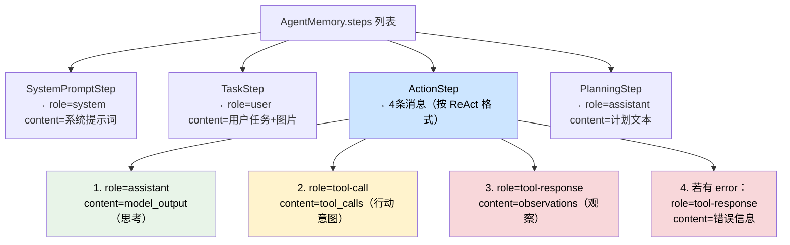
```mermaid
flowchart TD
    AM["AgentMemory.steps 列表"]

    AM --> S1["SystemPromptStep\n→ role=system\n   content=系统提示词"]
    AM --> S2["TaskStep\n→ role=user\n   content=用户任务+图片"]
    AM --> S3["ActionStep\n→ 4条消息（按 ReAct 格式）"]
    AM --> S4["PlanningStep\n→ role=assistant\n   content=计划文本"]

    S3 --> AS1["1. role=assistant\n   content=model_output（思考）"]
    S3 --> AS2["2. role=tool-call\n   content=tool_calls（行动意图）"]
    S3 --> AS3["3. role=tool-response\n   content=observations（观察）"]
    S3 --> AS4["4. 若有 error：\n   role=tool-response\n   content=错误信息"]

    style S3 fill:#cce5ff,color:#000
    style AS1 fill:#e8f4e8,color:#000
    style AS2 fill:#fff3cd,color:#000
    style AS3 fill:#f8d7da,color:#000
    style AS4 fill:#f8d7da,color:#000
```

---

## 6. local_python_executor.py — 本地沙箱

### 6.1 文件内主要类与函数

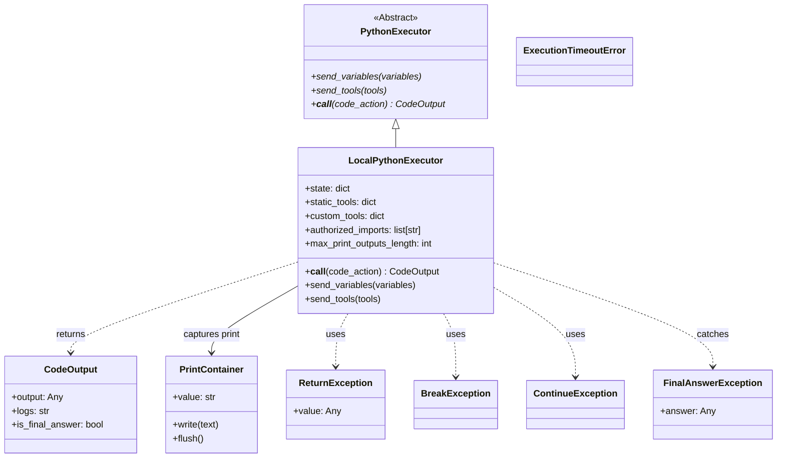
```mermaid
classDiagram
    class PythonExecutor {
        <<Abstract>>
        +send_variables(variables)*
        +send_tools(tools)*
        +__call__(code_action) CodeOutput*
    }

    class LocalPythonExecutor {
        +state: dict
        +static_tools: dict
        +custom_tools: dict
        +authorized_imports: list[str]
        +max_print_outputs_length: int
        +__call__(code_action) CodeOutput
        +send_variables(variables)
        +send_tools(tools)
    }

    class CodeOutput {
        +output: Any
        +logs: str
        +is_final_answer: bool
    }

    class PrintContainer {
        +value: str
        +write(text)
        +flush()
    }

    class ReturnException {
        +value: Any
    }
    class BreakException
    class ContinueException
    class ExecutionTimeoutError
    class FinalAnswerException {
        +answer: Any
    }

    PythonExecutor <|-- LocalPythonExecutor
    LocalPythonExecutor ..> CodeOutput : returns
    LocalPythonExecutor --> PrintContainer : captures print
    LocalPythonExecutor ..> ReturnException : uses
    LocalPythonExecutor ..> BreakException : uses
    LocalPythonExecutor ..> ContinueException : uses
    LocalPythonExecutor ..> FinalAnswerException : catches
```

### 6.2 5 层安全防护体系

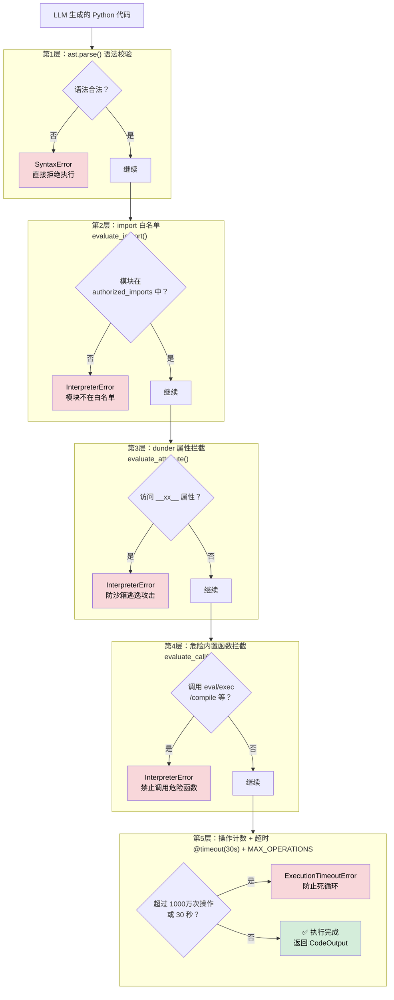
```mermaid
flowchart TD
    CODE["LLM 生成的 Python 代码"]

    CODE --> L1

    subgraph L1["第1层：ast.parse() 语法校验"]
        P1{"语法合法？"}
        P1 -- 否 --> E1["SyntaxError\n直接拒绝执行"]
        P1 -- 是 --> N1["继续"]
    end

    N1 --> L2

    subgraph L2["第2层：import 白名单\nevaluate_import()"]
        P2{"模块在\nauthorized_imports 中？"}
        P2 -- 否 --> E2["InterpreterError\n模块不在白名单"]
        P2 -- 是 --> N2["继续"]
    end

    N2 --> L3

    subgraph L3["第3层：dunder 属性拦截\nevaluate_attribute()"]
        P3{"访问 __xx__ 属性？"}
        P3 -- 是 --> E3["InterpreterError\n防沙箱逃逸攻击"]
        P3 -- 否 --> N3["继续"]
    end

    N3 --> L4

    subgraph L4["第4层：危险内置函数拦截\nevaluate_call()"]
        P4{"调用 eval/exec\n/compile 等？"}
        P4 -- 是 --> E4["InterpreterError\n禁止调用危险函数"]
        P4 -- 否 --> N4["继续"]
    end

    N4 --> L5

    subgraph L5["第5层：操作计数 + 超时\n@timeout(30s) + MAX_OPERATIONS"]
        P5{"超过 1000万次操作\n或 30 秒？"}
        P5 -- 是 --> E5["ExecutionTimeoutError\n防止死循环"]
        P5 -- 否 --> OK["✅ 执行完成\n返回 CodeOutput"]
    end

    style E1 fill:#f8d7da,color:#000
    style E2 fill:#f8d7da,color:#000
    style E3 fill:#f8d7da,color:#000
    style E4 fill:#f8d7da,color:#000
    style E5 fill:#f8d7da,color:#000
    style OK fill:#d4edda,color:#000
```

### 6.3 evaluate_ast() 调度器的 8 类节点

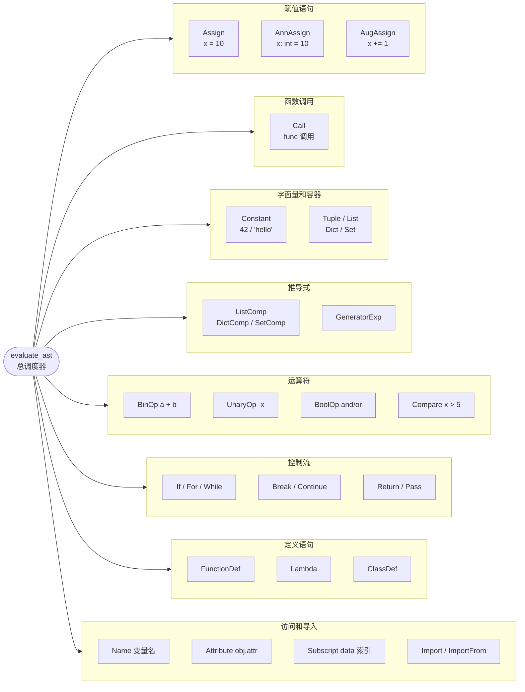
```mermaid
graph LR
    ROOT(["evaluate_ast\n总调度器"])

    subgraph G1["赋值语句"]
        A1["Assign\nx = 10"]
        A2["AnnAssign\nx: int = 10"]
        A3["AugAssign\nx += 1"]
    end

    subgraph G2["函数调用"]
        B1["Call\nfunc 调用"]
    end

    subgraph G3["字面量和容器"]
        C1["Constant\n42 / 'hello'"]
        C2["Tuple / List\nDict / Set"]
    end

    subgraph G4["推导式"]
        D1["ListComp\nDictComp / SetComp"]
        D2["GeneratorExp"]
    end

    subgraph G5["运算符"]
        E1["BinOp  a + b"]
        E2["UnaryOp  -x"]
        E3["BoolOp  and/or"]
        E4["Compare  x > 5"]
    end

    subgraph G6["控制流"]
        F1["If / For / While"]
        F2["Break / Continue"]
        F3["Return / Pass"]
    end

    subgraph G7["定义语句"]
        G71["FunctionDef"]
        G72["Lambda"]
        G73["ClassDef"]
    end

    subgraph G8["访问和导入"]
        H1["Name  变量名"]
        H2["Attribute  obj.attr"]
        H3["Subscript  data 索引"]
        H4["Import / ImportFrom"]
    end

    ROOT --> G1
    ROOT --> G2
    ROOT --> G3
    ROOT --> G4
    ROOT --> G5
    ROOT --> G6
    ROOT --> G7
    ROOT --> G8
```

---

## 7. remote_executors.py — 远程执行器

### 7.1 执行器继承树

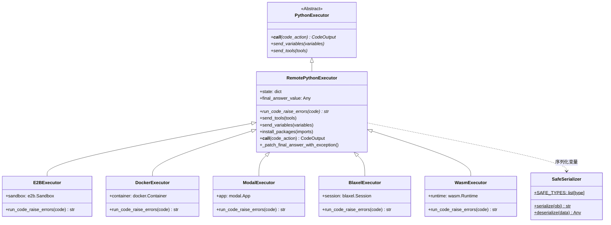
```mermaid
classDiagram
    class PythonExecutor {
        <<Abstract>>
        +__call__(code_action) CodeOutput*
        +send_variables(variables)*
        +send_tools(tools)*
    }

    class RemotePythonExecutor {
        +state: dict
        +final_answer_value: Any
        +run_code_raise_errors(code)* str
        +send_tools(tools)
        +send_variables(variables)
        +install_packages(imports)
        +__call__(code_action) CodeOutput
        +_patch_final_answer_with_exception()
    }

    class E2BExecutor {
        +sandbox: e2b.Sandbox
        +run_code_raise_errors(code) str
    }

    class DockerExecutor {
        +container: docker.Container
        +run_code_raise_errors(code) str
    }

    class ModalExecutor {
        +app: modal.App
        +run_code_raise_errors(code) str
    }

    class BlaxelExecutor {
        +session: blaxel.Session
        +run_code_raise_errors(code) str
    }

    class WasmExecutor {
        +runtime: wasm.Runtime
        +run_code_raise_errors(code) str
    }

    class SafeSerializer {
        +serialize(obj) str$
        +deserialize(data) Any$
        +SAFE_TYPES: list[type]$
    }

    PythonExecutor <|-- RemotePythonExecutor
    RemotePythonExecutor <|-- E2BExecutor
    RemotePythonExecutor <|-- DockerExecutor
    RemotePythonExecutor <|-- ModalExecutor
    RemotePythonExecutor <|-- BlaxelExecutor
    RemotePythonExecutor <|-- WasmExecutor
    RemotePythonExecutor ..> SafeSerializer : 序列化变量
```

### 7.2 远程执行器的工作流程

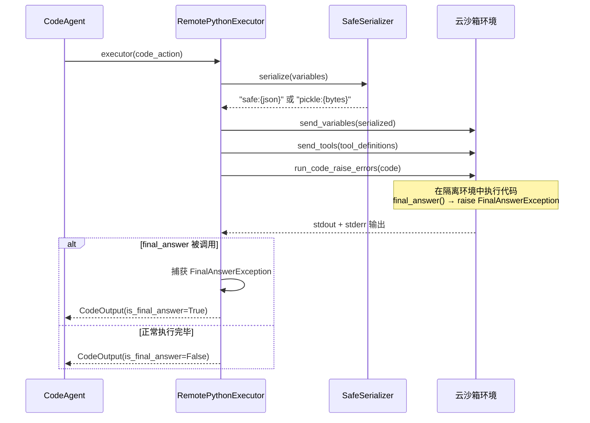
```mermaid
sequenceDiagram
    participant CA as CodeAgent
    participant RPE as RemotePythonExecutor
    participant SS as SafeSerializer
    participant CLOUD as 云沙箱环境

    CA ->> RPE: executor(code_action)

    RPE ->> SS: serialize(variables)
    SS -->> RPE: "safe:{json}" 或 "pickle:{bytes}"

    RPE ->> CLOUD: send_variables(serialized)
    RPE ->> CLOUD: send_tools(tool_definitions)

    RPE ->> CLOUD: run_code_raise_errors(code)
    Note over CLOUD: 在隔离环境中执行代码<br/>final_answer() → raise FinalAnswerException

    CLOUD -->> RPE: stdout + stderr 输出

    alt final_answer 被调用
        RPE ->> RPE: 捕获 FinalAnswerException
        RPE -->> CA: CodeOutput(is_final_answer=True)
    else 正常执行完毕
        RPE -->> CA: CodeOutput(is_final_answer=False)
    end
```

---

## 8. 跨文件协作：组件依赖全图

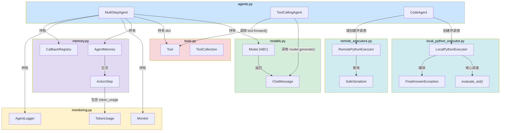
```mermaid
graph TD
    subgraph agents["agents.py"]
        MSA["MultiStepAgent"]
        TCA2["ToolCallingAgent"]
        CA2["CodeAgent"]
    end

    subgraph models["models.py"]
        MOD["Model (ABC)"]
        CM["ChatMessage"]
    end

    subgraph tools["tools.py"]
        T2["Tool"]
        TC2["ToolCollection"]
    end

    subgraph memory["memory.py"]
        AMEM["AgentMemory"]
        ASTEP["ActionStep"]
        CB["CallbackRegistry"]
    end

    subgraph local_exec["local_python_executor.py"]
        LPE2["LocalPythonExecutor"]
        EVA["evaluate_ast()"]
        FINAE["FinalAnswerException"]
    end

    subgraph remote_exec["remote_executors.py"]
        RPE2["RemotePythonExecutor"]
        SAFE["SafeSerializer"]
    end

    subgraph monitoring["monitoring.py"]
        MON["Monitor"]
        LOG["AgentLogger"]
        TU["TokenUsage"]
    end

    MSA -->|"持有"| MOD
    MSA -->|"持有 dict"| T2
    MSA -->|"持有"| AMEM
    MSA -->|"持有"| MON
    MSA -->|"持有"| LOG
    MSA -->|"持有"| CB

    TCA2 -->|"调用 model.generate()"| CM
    TCA2 -->|"调用 tool.forward()"| T2

    CA2 -->|"创建并调用"| LPE2
    CA2 -->|"或创建并调用"| RPE2

    AMEM -->|"包含"| ASTEP
    ASTEP -->|"包含 token_usage"| TU

    LPE2 -->|"核心调度"| EVA
    LPE2 -->|"捕获"| FINAE

    RPE2 -->|"使用"| SAFE

    MOD -->|"返回"| CM

    style agents fill:#cce5ff,color:#000
    style models fill:#d4edda,color:#000
    style tools fill:#f8d7da,color:#000
    style memory fill:#e2d9f3,color:#000
    style local_exec fill:#d1ecf1,color:#000
    style remote_exec fill:#d1ecf1,color:#000
    style monitoring fill:#fff3cd,color:#000
```

---

## 9. ReAct 循环完整执行流程

以 `CodeAgent` 为例，走一遍完整的多步 ReAct 循环：

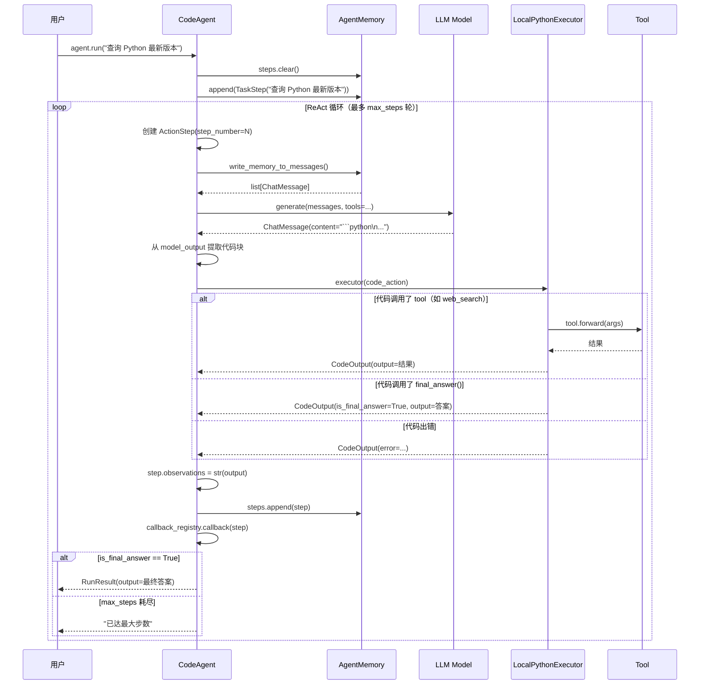
```mermaid
sequenceDiagram
    participant User as 用户
    participant Agent as CodeAgent
    participant Mem as AgentMemory
    participant Model as LLM Model
    participant Exec as LocalPythonExecutor
    participant Tool as Tool

    User ->> Agent: agent.run("查询 Python 最新版本")

    Agent ->> Mem: steps.clear()
    Agent ->> Mem: append(TaskStep("查询 Python 最新版本"))

    loop ReAct 循环（最多 max_steps 轮）

        Agent ->> Agent: 创建 ActionStep(step_number=N)

        Agent ->> Mem: write_memory_to_messages()
        Mem -->> Agent: list[ChatMessage]

        Agent ->> Model: generate(messages, tools=...)
        Model -->> Agent: ChatMessage(content="```python\n...")

        Agent ->> Agent: 从 model_output 提取代码块

        Agent ->> Exec: executor(code_action)

        alt 代码调用了 tool（如 web_search）
            Exec ->> Tool: tool.forward(args)
            Tool -->> Exec: 结果
            Exec -->> Agent: CodeOutput(output=结果)
        else 代码调用了 final_answer()
            Exec -->> Agent: CodeOutput(is_final_answer=True, output=答案)
        else 代码出错
            Exec -->> Agent: CodeOutput(error=...)
        end

        Agent ->> Agent: step.observations = str(output)
        Agent ->> Mem: steps.append(step)
        Agent ->> Agent: callback_registry.callback(step)

        alt is_final_answer == True
            Agent -->> User: RunResult(output=最终答案)
        else max_steps 耗尽
            Agent -->> User: "已达最大步数"
        end
    end
```

---

## 10. ToolCallingAgent vs CodeAgent 对比

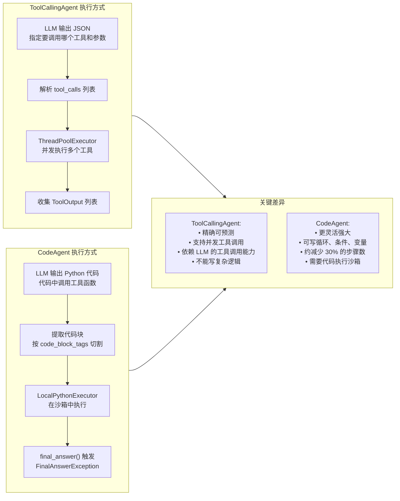
```mermaid
flowchart LR
    subgraph TCA_FLOW["ToolCallingAgent 执行方式"]
        direction TB
        T1["LLM 输出 JSON\n指定要调用哪个工具和参数"]
        T2["解析 tool_calls 列表"]
        T3["ThreadPoolExecutor\n并发执行多个工具"]
        T4["收集 ToolOutput 列表"]
        T1 --> T2 --> T3 --> T4
    end

    subgraph CA_FLOW["CodeAgent 执行方式"]
        direction TB
        C1["LLM 输出 Python 代码\n代码中调用工具函数"]
        C2["提取代码块\n按 code_block_tags 切割"]
        C3["LocalPythonExecutor\n在沙箱中执行"]
        C4["final_answer() 触发\nFinalAnswerException"]
        C1 --> C2 --> C3 --> C4
    end

    subgraph COMPARE["关键差异"]
        direction TB
        D1["ToolCallingAgent:\n• 精确可预测\n• 支持并发工具调用\n• 依赖 LLM 的工具调用能力\n• 不能写复杂逻辑"]
        D2["CodeAgent:\n• 更灵活强大\n• 可写循环、条件、变量\n• 约减少 30% 的步骤数\n• 需要代码执行沙箱"]
    end

    TCA_FLOW --> COMPARE
    CA_FLOW --> COMPARE
```

| 维度 | ToolCallingAgent | CodeAgent |
|------|-----------------|-----------|
| LLM 输出 | JSON（工具调用格式） | Python 代码 |
| 执行引擎 | 直接调用 `tool.forward()` | `LocalPythonExecutor` 沙箱 |
| 并发 | `ThreadPoolExecutor` 并发 | 单次执行，代码内并发 |
| 灵活性 | 限于单次工具调用 | 可写完整程序逻辑 |
| 步骤数 | 较多 | 约少 30% |
| 安全性 | 工具白名单 | 5 层沙箱防护 |
| 适用场景 | 简单工具编排 | 复杂数据处理、多步推理 |

---

## 11. 数据在各组件间的流动

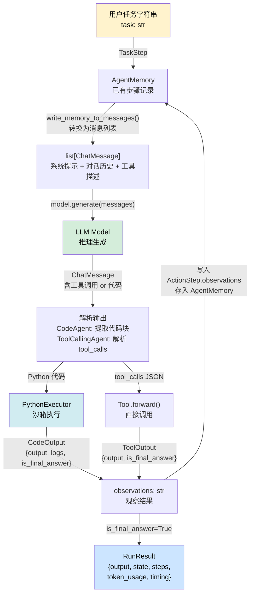
```mermaid
flowchart TD
    TASK["用户任务字符串\ntask: str"]

    TASK -->|"TaskStep"| MEM_IN["AgentMemory\n已有步骤记录"]

    MEM_IN -->|"write_memory_to_messages()\n转换为消息列表"| MSGS["list[ChatMessage]\n系统提示 + 对话历史 + 工具描述"]

    MSGS -->|"model.generate(messages)"| LLM["LLM Model\n推理生成"]

    LLM -->|"ChatMessage\n含工具调用 or 代码"| PARSE["解析输出\nCodeAgent: 提取代码块\nToolCallingAgent: 解析 tool_calls"]

    PARSE -->|"Python 代码"| EXEC["PythonExecutor\n沙箱执行"]
    PARSE -->|"tool_calls JSON"| TCALL["Tool.forward()\n直接调用"]

    EXEC -->|"CodeOutput\n{output, logs, is_final_answer}"| OBS
    TCALL -->|"ToolOutput\n{output, is_final_answer}"| OBS

    OBS["observations: str\n观察结果"]

    OBS -->|"写入 ActionStep.observations\n存入 AgentMemory"| MEM_IN

    OBS -->|"is_final_answer=True"| FINAL["RunResult\n{output, state, steps,\ntoken_usage, timing}"]

    style TASK fill:#fff3cd,color:#000
    style LLM fill:#d4edda,color:#000
    style EXEC fill:#d1ecf1,color:#000
    style FINAL fill:#cce5ff,color:#000
```

---

## 12. 初始化链路

```mermaid
flowchart TD
    subgraph INIT["CodeAgent 初始化"]
        direction TB

        A["CodeAgent.__init__(tools, model, ...)"]
        A --> A1["设置 authorized_imports\n = BASE_BUILTIN_MODULES + 用户白名单"]
        A --> A2["加载 YAML 提示词模板\ncode_agent.yaml 或\nstructured_code_agent.yaml"]
        A --> A3["super().__init__()\n调用 MultiStepAgent.__init__"]

        subgraph MSA_INIT["MultiStepAgent.__init__()"]
            direction TB
            B1["_setup_tools(tools)\n转为 dict[name→Tool]\n按需注入 FinalAnswerTool"]
            B2["_setup_managed_agents(managed_agents)\n子 Agent 也变成 Tool"]
            B3["self.memory = AgentMemory(system_prompt)"]
            B4["self.logger = AgentLogger(verbosity_level)"]
            B5["self.monitor = Monitor(model, logger)"]
            B6["CallbackRegistry()\n注册用户的 step_callbacks"]
            B1 --> B2 --> B3 --> B4 --> B5 --> B6
        end

        A3 --> MSA_INIT
        A4["create_python_executor()\n根据 executor_type 创建执行器"]
        MSA_INIT --> A4

        subgraph EXEC_INIT["执行器初始化"]
            direction LR
            E1{"executor_type"}
            E1 -- local --> E2["LocalPythonExecutor(authorized_imports)\nstate = 空字典\nstatic_tools = Agent工具+BASE_PYTHON_TOOLS"]
            E1 -- e2b --> E3["E2BExecutor\n连接 E2B 云沙箱"]
            E1 -- docker --> E4["DockerExecutor\n启动 Docker 容器"]
        end

        A4 --> EXEC_INIT
    end

    style A fill:#cce5ff,color:#000
    style MSA_INIT fill:#e2d9f3,color:#000
    style EXEC_INIT fill:#d1ecf1,color:#000
```

---

## 附：公共 API 导出一览

```mermaid
graph LR
    subgraph PKG["smolagents 包\n__init__.py"]
        subgraph A_OUT["agents.py 导出"]
            A1["MultiStepAgent\nToolCallingAgent\nCodeAgent\nRunResult"]
        end
        subgraph M_OUT["models.py 导出"]
            M1["Model\nChatMessage\nMessageRole\nLiteLLMModel\nOpenAIModel\n...等 10 个"]
        end
        subgraph T_OUT["tools.py 导出"]
            T1["Tool\nBaseTool\nToolCollection\n@tool 装饰器\nPipelineTool"]
        end
        subgraph ME_OUT["memory.py 导出"]
            ME1["AgentMemory\nActionStep\nMemoryStep\nToolCall\nCallbackRegistry"]
        end
        subgraph E_OUT["executors 导出"]
            E1["LocalPythonExecutor\nE2BExecutor\nDockerExecutor\nModalExecutor\nWasmExecutor\nCodeOutput"]
        end
        subgraph MO_OUT["monitoring.py 导出"]
            MO1["Monitor\nTokenUsage\nTiming\nAgentLogger\nLogLevel"]
        end
    end
```
